# Vehicle for Small and Remote Space Mapping

**Bachelor's thesis** · Brno University of Technology, Faculty of Information Technology, Department of Computer Systems · 2018
**Author:** Pavel Koupý · **Supervisor:** Ing. Vítězslav Beran, Ph.D.

> English adaptation of the original Czech thesis ([`dokumentace.pdf`](dokumentace.pdf)). The text is translated and lightly condensed. The formal parts (declaration, acknowledgements) are left out.

<p align="center">
  
</p>

## Abstract

This project covers building a robotic vehicle for remote mapping of small indoor spaces. It includes the mechanical design, the choice and wiring of the electronics, and an operator interface for remote control, live camera streaming and autonomous exploration of a room.

**Keywords:** autonomous vehicle, robotics, Arduino, Raspberry Pi, ROS, localization and mapping (SLAM), remote control

## Contents

1. [Introduction](#1-introduction)
2. [Construction and electronics](#2-construction-and-electronics)
3. [Software](#3-software)
   - [3.1 ROS and the operating system](#31-ros-and-the-operating-system)
   - [3.2 Drive control and user interface](#32-drive-control-and-user-interface)
   - [3.3 Autonomous control](#33-autonomous-control)
   - [3.4 Mapping and localization (ORB-SLAM2)](#34-mapping-and-localization-orb-slam2)
4. [Conclusion](#4-conclusion)
5. [Repository layout](#repository-layout)
6. [Appendix A – Costs](#appendix-a--costs)
7. [References](#references)

---

## 1. Introduction

Autonomous vehicles and robots draw on more than software. The mechanical build and the circuit design matter just as much, and a programmer working on a PC rarely sees those parts. Many kits and ready-made solutions exist, but this project set out to do the whole thing: from 3D-printing the wheels and chassis to writing the user interface and the rest of the software.

The goal was a **low-cost, general-purpose platform** that carries a computer able to run:

- localization and mapping of the vehicle in space,
- drive control,
- a camera stream for remote operation,
- and other tools and sensors.

The vehicle should be able to explore indoor spaces on its own, while an operator can start autonomous exploration or drive it remotely using the camera and sensors. The main sensor is a **single camera**, together with cheap extras: an **ultrasonic distance sensor** and a **touch (wire) bumper**. The vehicle has four **Mecanum wheels**, so it can build a map of its surroundings and localize itself in it, even in tight spaces.

The work was split into three parts:

- building the vehicle,
- choosing the electronics and designing the circuits,
- implementing the required functionality as **ROS nodes**.

Experiments were run in a room at home, with fake walls and cardboard-box obstacles of various sizes, to test the ultrasonic and touch sensors. The tests are mostly subjective: does each component work as expected? They covered:

- autonomous mode,
- simultaneous localization and mapping (SLAM),
- manual control.

A demo video of the experiments was submitted with the thesis.

## 2. Construction and electronics

### 2.1 Existing vehicles and platforms

Commercial robots fall roughly into three groups:

1. **Specialized service platforms**, e.g. [Fetch Robotics](https://fetchrobotics.com/) warehouse robots.
2. **Tele-operation platforms**, e.g. [Sanbot](http://www.sanbot.com/) and [PR2](http://www.willowgarage.com/pages/pr2/overview). Most of these offer both automated tasks and remote control or "virtual presence", and they usually rely on SLAM to plan paths through unknown spaces.
3. **Kits for kids and hobbyists**, e.g. [DRC mark 1](https://www.robotshop.com/letsmakerobots/daddys-robot-car-drc-mark-1) (three wheels, differential front drive), [J-bot office](https://www.jameco.com/jameco/workshop/JamecoBuilds/jbotrobot.html) (four driven wheels) and the [KUKA youBot](http://www.youbot-store.com/), a mobile manipulator on **Mecanum wheels**.

The first two groups are expensive and specialized, and the quality of the third depends heavily on price. The aim was to combine ideas from all three into something cheap and easy to extend.

**Mecanum wheels** are common in warehouses and other places with no room to maneuver. The vehicle can move in any direction without turning its body, and it can rotate on the spot, which suits small, hard-to-reach spaces very well. No custom design was needed in the end: a freely available printable kit on [Thingiverse](https://www.thingiverse.com/thing:1358552) fit the bill.

### 2.2 Construction

- The plastic parts are printed in **PLA** (melting point about 215 °C) at **0.20 mm** layer height. Parts that don't need a smooth surface are printed at **0.35 mm**, which cuts print time a lot.
- The models come from Thingiverse under **CC BY-SA 3.0** and were used unmodified.
- A simpler **prototype** was built first to test the electronics, and some of its printed parts were reused in the final version.

<p align="center">
  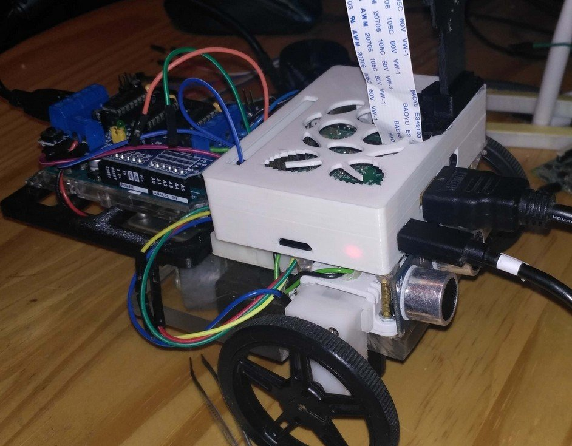<br>
  <em>Figure 3: Prototype</em>
</p>

The final chassis is a **four-motor differential drive** using [Pololu micro metal gearmotors](https://www.pololu.com/file/0J1487/pololu-micro-metal-gearmotors.pdf) with a **1:100** metal gearbox, rated for **9 V**.

Each wheel is a load-bearing frame with **nine rollers**, held on by metal pins. Every roller is wrapped in heat-shrink tubing for better traction. The wheels and motors are attached to the chassis with two screws and a plastic clamp.

<p align="center">
  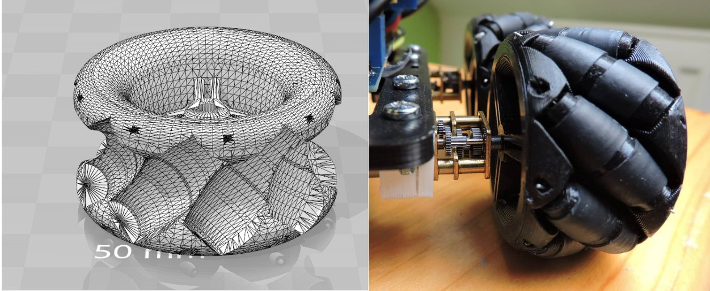<br>
  <em>Figure 4: Wheel detail</em>
</p>

Because of the Mecanum wheels, steering is different from a normal four-motor differential drive. The figure below shows how each wheel's rotation (red arrows) combines into the vehicle's resulting motion (black arrow).

<p align="center">
  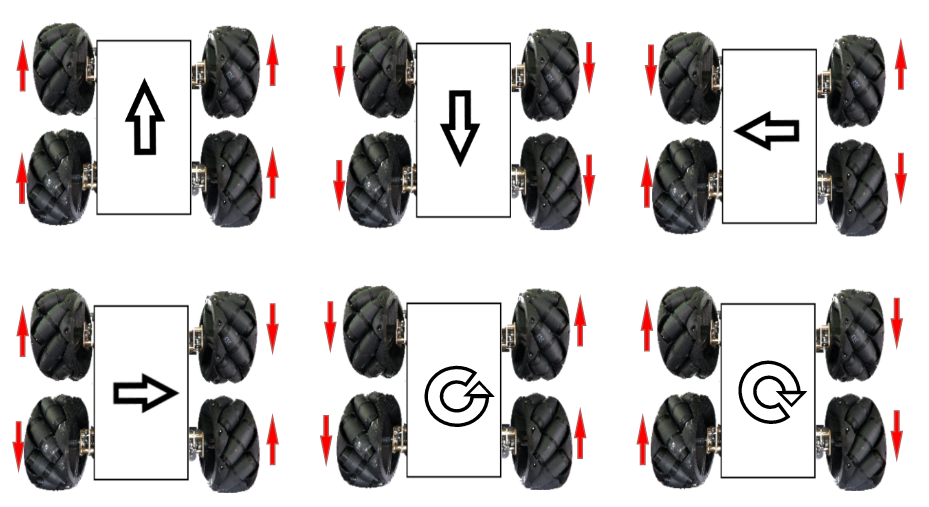<br>
  <em>Figure 5: Drive and steering</em>
</p>

The chassis plates, the computer case and the battery holder are joined with **standoffs** of various lengths, so the base frame is easy to extend with more sensors or actuators. The downside: with that much electronics and the batteries mounted fairly high, the **center of gravity is high**. The vehicle can handle a slope of at most **35°**.

### 2.3 Electronics

Components were chosen for ease of use, price, available libraries and local availability.

| Role | Component | Why |
|---|---|---|
| Main computer | **Raspberry Pi 3** | Runs ROS and SLAM on board, with no other computer needed. Built-in Wi-Fi is used for the operator link. Part of the point was to find out whether SLAM can run on a single-board ARM computer with limited RAM. |
| Motor controller | **Arduino UNO** (ATmega328P) + L293D motor shield | Keeps the motors' current spikes, especially when starting up, away from the Pi. Connected to the Pi over **USB serial**, which also powers it from the Pi while debugging. |
| Camera | Raspberry Pi Camera Module (5 MP, 2592×1944) | Connected directly over the flat ribbon cable. Run at a lower resolution, 640×480, to save CPU and bandwidth. |
| Distance sensor | **HC-SR04** ultrasonic | Cheap distance measurement. |
| Touch sensor | Wire bumper | Collision detection. |
| Power | 6× AAA NiMH (7.2 V) + **LM2596** step-down regulator | Converts the battery voltage to 5 V for the Pi. |

An FPGA with a microprocessor was also considered, but an off-the-shelf ARM board is much easier to work with.

<p align="center">
  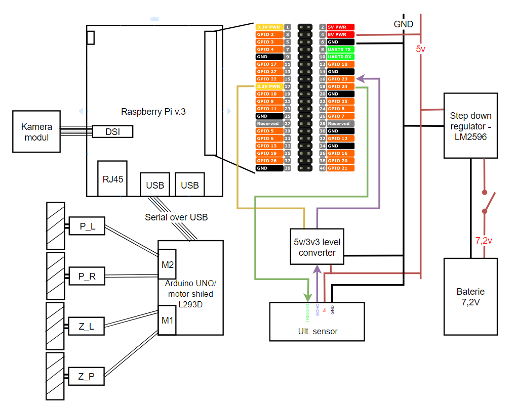<br>
  <em>Figure 7: Wiring diagram</em>
</p>

#### Motor driver

The motors are driven by an Arduino **shield** with two **L293D** chips (each one is four half H-bridges, i.e. two full H-bridges) and a **74HC595N** shift register. Each L293D drives a pair of motors using **PWM**. The 74HC595N converts serial data from the Arduino into parallel outputs that set each motor's direction (signals M1A/B … M4A/B). The PWM duty cycle on PWM2A/PWM2B sets the motor speed, i.e. the average voltage at the motor terminals.

<p align="center">
  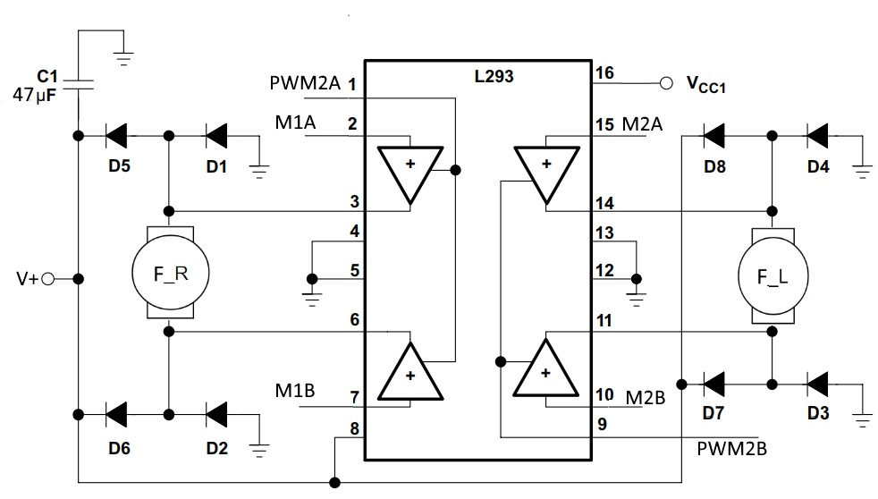<br>
  <em>Figure 8: DC motor wiring (front motors)</em>
</p>

Diodes D1–D8 protect the electronics from voltage spikes from the motors. Capacitor C1 smooths the 5 V reference. VCC1 equals V+ (5 V) because the board is powered over USB.

#### Power

An **LM2596** step-down regulator (input up to 46 V, output adjustable in 0.1 V steps, up to 3 A) converts the **7.2 V** from six AAA NiMH cells to **5 V** for the Pi. The Pi documentation recommends a 2.5 A supply, so 3 A leaves some headroom. The module also has short-circuit, overheating and reverse-polarity protection.

#### Sensors

- **Touch bumper**: 3.3 V is fed into the bumper wire, and the standoffs are wired to a Pi GPIO input. When the wire touches a standoff, the pin reads logic 1.
- **Ultrasonic sensor HC-SR04**: it uses 5 V logic, but the Pi's GPIO is 3.3 V. **Trigger** is an input to the sensor, so it can be driven directly from a 3.3 V pin. **Echo** is a 5 V TTL output and goes through a **BSS138 MOSFET logic-level shifter** (LV = 3.3 V, HV = 5 V). Trigger is on physical pin **16** and Echo on physical pin **18**. The software uses the [WiringPi](http://wiringpi.com/) library.

<p align="center">
  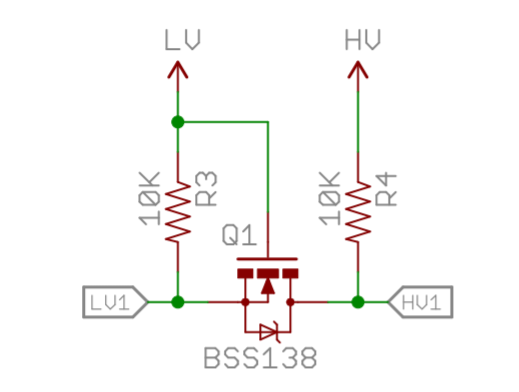<br>
  <em>Figure 10: Logic-level shifter</em>
</p>

## 3. Software

The vehicle runs on **ROS** ([Robot Operating System](http://www.ros.org/)). ROS makes it easy to split the software into separate parts and to plug in existing tools. The most interesting part is the **autonomous control node**, which oversees all the other running nodes and picks its next action using a **subsumption architecture**.

There were two options for the overall setup:

1. **Client–server**, as in the ROSberryPi SLAM Robot project [2], with SLAM running on a separate PC.
2. **Everything on the Raspberry Pi**, controlled remotely over **SSH** from a graphical interface. This was the option chosen, as an experiment: it wasn't clear in advance whether the Pi would have enough computing power.

[Rosbridge](http://wiki.ros.org/rosbridge_suite) provides a WebSocket server for talking to ROS without a local ROS install. But controlling the Linux system itself through ROS needs superuser rights, which is risky and can break the system or even corrupt the Pi's SD card. Also, the only other computer available ran Windows, which has no fully working ROS implementation. So the interface was built on **SSH**.

### 3.1 ROS and the operating system

ROS splits the system into **nodes**: separate processes for the ultrasonic sensor, the touch sensor, autonomous control, SLAM and so on. Nodes communicate over **topics**. A node can **publish** messages to a topic or **subscribe** to one. Messages can be built-in types (strings, numbers, predefined structures) or custom types. Packages usually include **launch files**, which make starting and configuring nodes much less error-prone.

The nodes are written in **C++** using `roscpp`. **ROSSerial** handles communication with the Arduino.

| Topic | Type | Publisher → Subscriber |
|---|---|---|
| `ult_sensor` | `Float32` | ultrasonic node → auto mode, GUI status |
| `whiskers_sensor` | `Bool` | touch-bumper node → auto mode, GUI status |
| `motors_ctrl` | `UInt16` | auto mode / GUI → Arduino |
| `motors_speed` | `String` | GUI → Arduino |
| `automode_ctrl` | `String` | GUI → auto mode |
| `automode_status` | `Int16` | auto mode → GUI status |
| `orb_slam` | `Int16` | ORB-SLAM2 (modified mono node) → GUI status |
| `/camera/image_raw` | `Image` | camera (decompressed) → ORB-SLAM2 |

**Platform:** [ROS Kinetic](http://wiki.ros.org/ROSberryPi/Installing%20ROS%20Kinetic%20on%20the%20Raspberry%20Pi) on **Ubuntu MATE 16.04.4 LTS (32-bit)**. Most ROS tooling is supported there. The Ethernet interface has a static IP for first-time setup of the wireless link, which is then used for remote control.

> **Build tip:** the Pi has only **1 GB of RAM**. Compiling ORB-SLAM2 and its dependencies needed a **2 GB swap file** on the SD card, and the build had to use `-j2` instead of `-j4`.

### 3.2 Drive control and user interface

The **Arduino** runs as a regular **ROS node** through ROSSerial. A state machine inside the node receives commands on the `motors_ctrl` topic and carries them out in a loop with a fixed period. PWM generation and motor control use the [Adafruit Motor Shield library](https://github.com/adafruit/Adafruit-Motor-Shield-library). Only two calls are needed:

- `run(direction)` sets a motor's direction, or stops it,
- `setSpeed(value)` sets the PWM duty cycle, i.e. the speed.

On every `run()` call, the library sends a data word to the shift register on the shield, which drives the direction inputs of the L293D chips.

#### 3.2.1 User interface (`PiInterface`)

The remote-control application is a Windows **MFC** application that connects to the vehicle with [libssh](https://www.libssh.org/). It has two screens, switched with a Tab Control. Each screen is its own class, and configuration is loaded by the main dialog and passed to the screens by reference.

**Motion control (`MotionControlTab`)**: set motor speeds, interact with autonomous mode, read sensor data and watch the camera. You can drive with on-screen buttons, which latch so you don't have to hold them down, or with a **joystick**, read through **Raw Input** HID events.

<p align="center">
  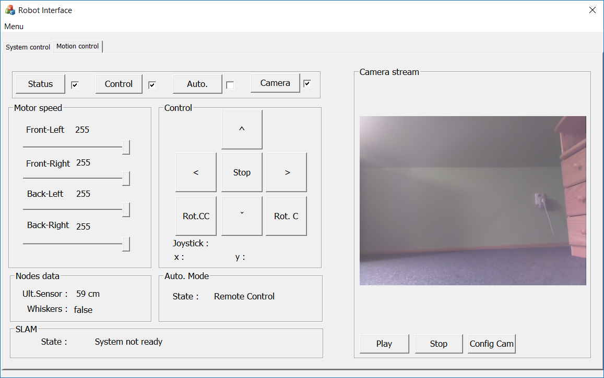<br>
  <em>Figure 11: Remote-control interface</em>
</p>

Two background threads, each with its own SSH channel and shell, keep this screen running:

- `WatchStatusRun()` starts a ROS node that prints `ult_sensor`, `whiskers_sensor`, `automode_status` and `orb_slam` to stdout. The UI reads and parses that output from the SSH channel. This is the ROS → UI bridge.
- `ControlUpdate()` writes commands to the shell. A ROS node reads them from stdin and forwards them to the right topics. This is the UI → ROS bridge.

Both threads are started from the UI and controlled through atomic flags. The driving direction is an atomic global variable. There's no mutex, because exactly one thread writes it and one thread reads it.

**Video** is received with [libVLC](https://www.videolan.org/vlc/libvlc.html) through a small C++ [wrapper](https://www.codeproject.com/Articles/38952/VLCWrapper-A-Little-C-wrapper-Around-libvlc). The Pi streams **MJPEG**, a format designed for CCTV, through **UV4L**, which runs a web server on port **8080** where you can also set resolution, rotation and format. UV4L can do OpenCV face detection too, but it noticeably slows the stream down. When SLAM is started, the stream is killed, because ORB-SLAM2 captures the camera through a different tool and the two would collide. ORB-SLAM2 also needs **raw**, uncompressed frames, which would be far too much for the Pi's Wi-Fi, since it also carries all the control traffic.

**System control (`SystemControlTab`)**: starts ROS nodes and manages the whole OS. There's a simple **console** that shows command output and accepts custom commands. The commands behind the buttons are defined in an **INI file**, read at startup with [inih](https://github.com/jtilly/inih), so changes need an application restart. From here you can shut down or reboot the vehicle, check system parameters and network settings, and start a **remote-desktop server**. Remote desktop is currently the only way to watch the SLAM output, because the 3D map isn't streamed into the application.

<p align="center">
  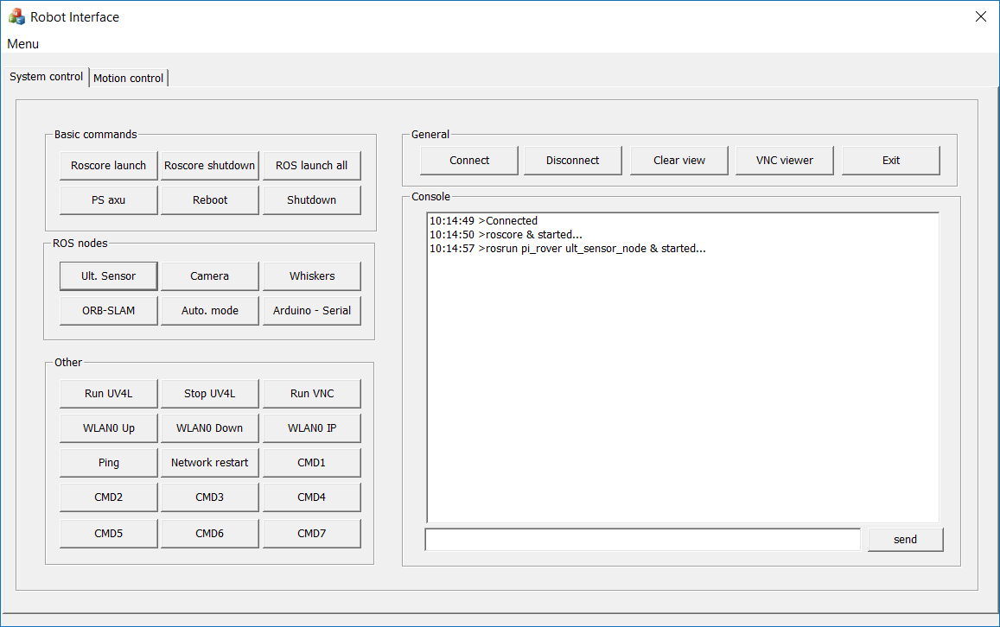<br>
  <em>Figure 12: OS control and vehicle system startup</em>
</p>

#### 3.2.2 System test

All ROS nodes were started from the UI while CPU temperature, load and memory were monitored:

| Metric | Idle | Everything running |
|---|---|---|
| CPU temperature | ~35 °C | ~58 °C |
| CPU core frequency | 0.6 GHz | 1.2 GHz |
| CPU load | ~5 % | ~85 % |
| Memory used (no swap) | 200 MB | 750 MB |

The Raspberry Pi **is powerful enough**, but only just. It needs a **fan and passive heatsinks**.

#### 3.2.3 Manual control test

The vehicle was driven around the test area using only the camera and the UI, with no direct view of it, starting just the sensor nodes and the Arduino serial node. The interface worked well. It offers everything a plain terminal does, plus preset commands and simple driving controls.

### 3.3 Autonomous control

#### 3.3.1 Subsumption architecture

The classic approach to robot autonomy is a pipeline of functional stages: sensing → mapping → planning → action. Each stage only sees the previous stage's output, so errors build up along the chain.

The **subsumption architecture** proposed by Rodney Brooks [5] takes the opposite approach. Behavior is split into **layers**, each pursuing one goal (avoid an obstacle, wander around) and reacting directly to the environment. These are **reactive agents**: they don't build a symbolic model of the world, and there's no central planner. Every layer can issue motion commands. Higher layers do more complex things, such as exploring and wandering, and normally suppress the lower ones. Lower, more primitive layers, such as collision handling, take over when something urgent happens. The result is surprisingly complex behavior that can run for a long time without an operator.

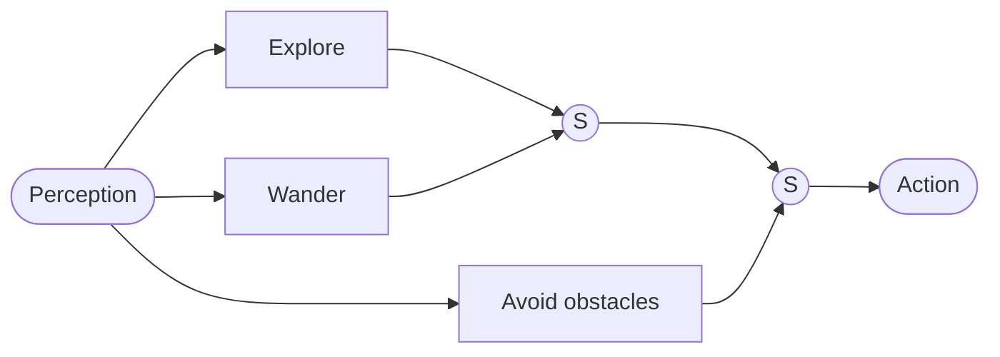
<p align="center"><em>Figure 13: Example reactive-agent architecture (S = suppression node)</em></p>

Each layer is usually a **finite state machine** that reacts to sensor input. Formally, a reactive agent is the six-tuple **{P, A, I, see, next, action}**:

- `see : E → P`: the agent perceives part of the environment state *E* as a percept *P*,
- `next : P × I → I`: the percept and the current internal state give a new internal state,
- `action : P × I → A`: the percept and the state select an action,
- `env : A × E → E`: the action changes the environment.

A **purely reactive** agent keeps no internal state, which reduces this to {P, A, see, action}. The implementation follows this model loosely, adapted to fit ROS.

#### 3.3.2 Sensors

Autonomous mode uses the **wire bumper** and the **ultrasonic sensor**, each with its own ROS node, both connected over GPIO and read with WiringPi (physical pin numbering).

The speed of sound in dry air at 25 °C is about **346.1 m/s** (rounded to 346 m/s). The node measures the time *t* between the Trigger pulse and the falling edge of Echo, to microsecond precision:

```
distance = t × 346 m/s / 2
```

<p align="center">
  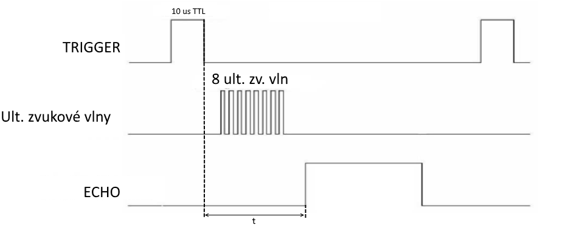<br>
  <em>Figure 14: Ultrasonic sensor timing. A 10 µs TTL Trigger pulse sends a burst of 8 ultrasonic pulses ("8 ult. zv. vln"), and Echo stays high for time t.</em>
</p>

#### 3.3.3 Implementation

Autonomous mode is a separate ROS node ([`auto_mode.cpp`](src/pi_rover/src/auto_mode.cpp)) containing **three state machines**. Each one is a function called from the main ROS loop, with global variables as its inputs and global flags that **inhibit** its outputs. The node needs the sensor nodes and the motor node to be running. It also accepts simple commands on `automode_ctrl`, so you can switch between autonomous and manual driving.

**Level 1: collision handling** (wire bumper)

<p align="center">
  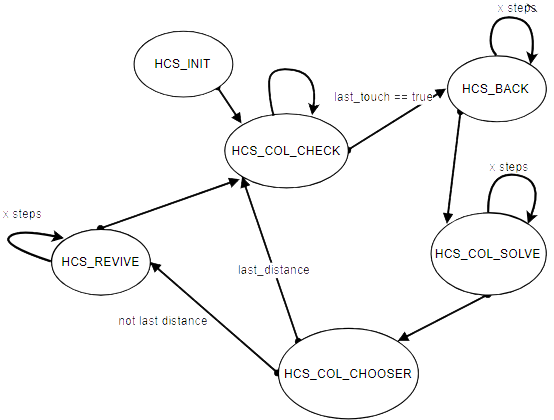<br>
  <em>Figure 15: Level 1 state transitions</em>
</p>

`HCS_INIT` → `HCS_COL_CHECK` checks `last_touch`. On a collision the machine goes to `HCS_BACK` and backs up a few steps, then to `HCS_COL_SOLVE`: the vehicle **rotates 270°** and takes a distance reading at every third of the turn. In `HCS_COL_CHOOSER` it picks the **largest distance** and works out how many steps it needs to face that way (`HCS_COL_REVIVE`, shown as `HCS_REVIVE` in the diagram). If the last reading was already the largest, it's facing the right way and goes back to `HCS_COL_CHECK`.

**Level 2: following walls** (ultrasonic)

<p align="center">
  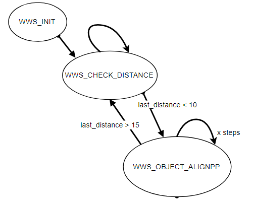<br>
  <em>Figure 16: Level 2 state transitions</em>
</p>

`WWS_INIT` → `WWS_CHECK_DISTANCE`. If the distance to an obstacle drops **below 10 cm**, the machine goes to `WWS_OBJECT_ALIGNPP` and turns until the distance is **at least 15 cm**, then goes back to checking. Simple as it is, this is the **most used** layer and avoids most collisions. The other two mostly handle edge cases.

**Level 3: random wandering**

<p align="center">
  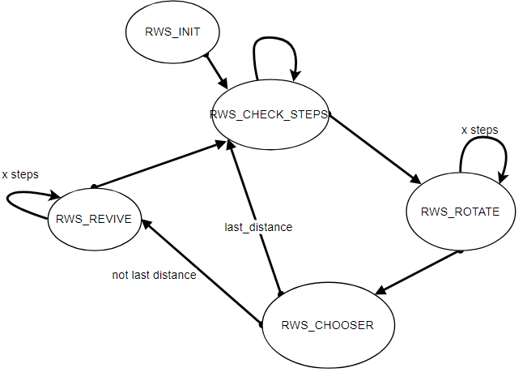<br>
  <em>Figure 17: Level 3 state transitions</em>
</p>

`RWS_INIT` → `RWS_CHECK_STEPS` counts forward steps. Above a threshold of **200 steps**, `RWS_ROTATE` spins the vehicle and measures the distance at **four random headings**. `RWS_CHOOSER` picks the longest, and `RWS_REVIVE` steers that way if a correction is needed. Otherwise the vehicle keeps going straight.

**How the layers interact:** while level 1 is handling a collision, the higher levels are paused until it reports the collision resolved. Priority between levels 2 and 3 depends on the step history: after too long driving straight, a 360° distance scan starts. In the main loop, the default command is "step forward". The direction variable is then **filtered through the three machines in sequence**, and the result is sent to the Arduino's control state machine. Switching to manual mode turns off all autonomous layers, and sensor data then goes only to the UI.

#### 3.3.4 Testing

The vehicle was placed at a random position, with SLAM off, to see whether it could explore the room sensibly without getting stuck in one spot or a dead end. The result was **fairly positive**. The vehicle drove through the space with purpose and wove between obstacles. There were some problems, like getting lost or tipping over, but it did better than expected. The main issue was the **number of steps needed for a full turn**: the wheels aren't perfect, so it varies with the floor surface. An averaged value was used in the end, since precision isn't critical here.

#### 3.3.5 Limitations

- Low obstacles such as **cables** aren't detected by any sensor.
- There's **no state machine managing mapping and localization**, in particular for initializing SLAM and **recovering when it loses tracking**. Recovering was hard even when driving manually: the vehicle has to be maneuvered back to a spot where it can re-localize. Once a good map has been built manually, localization also works in autonomous mode, and turning in place or backing up a few steps is usually enough.

### 3.4 Mapping and localization (ORB-SLAM2)

#### 3.4.1 Navigation

To navigate, whether autonomously or manually, the vehicle needs to know at least roughly where it is, which also means building a map. **SLAM** algorithms solve both together. Most setups use **LIDAR, stereo or RGB-D** cameras, which are expensive, and fusing their data costs a lot of computing power. This project tries to use **a single monocular camera**, so the operator can see the mapped space and follow the vehicle on the map.

#### 3.4.2 SLAM

The vehicle explores unknown space, builds the map step by step, and estimates its own pose in it [4].

<p align="center">
  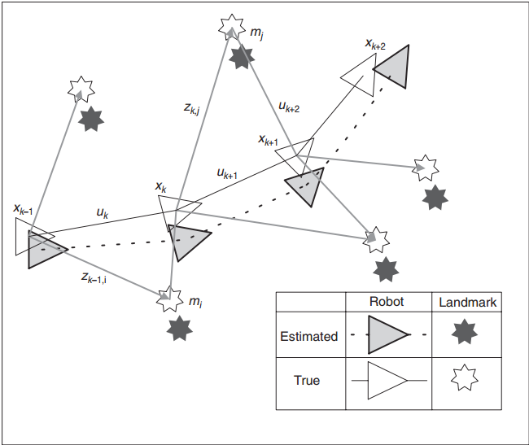<br>
  <em>Figure 18: The SLAM problem in general</em>
</p>

- **x<sub>k</sub>**: the vehicle's position and orientation,
- **m<sub>i</sub>**: the position of landmark *i* (static),
- **z<sub>k,i</sub>**: an observation of landmark *m<sub>i</sub>* from pose *x<sub>k</sub>*,
- **u<sub>k</sub>**: the control vector applied at *x<sub>k−1</sub>* to reach *x<sub>k</sub>*.

The estimate is probabilistic (conditional probability densities). Keeping a history of past motions and observations reduces the uncertainty in the vehicle's pose relative to the landmarks. The most common representation is a state-space model with Gaussian noise, which leads to the **Extended Kalman Filter (EKF)**. **FastSLAM** is a popular alternative. With a **monocular** camera, you also have to solve **initialization** and the **depth of landmarks**, which a single image can't give you directly [1], [3].

#### 3.4.3 Implementation

[ORB-SLAM2](https://github.com/raulmur/ORB_SLAM2) [6] needed these to be built and installed first: [Pangolin](https://github.com/stevenlovegrove/Pangolin) (map visualization), [OpenCV](https://opencv.org/), [Eigen3](http://eigen.tuxfamily.org/) and [DBoW2](https://github.com/dorian3d/DBoW2).

Changes made for this project:

- **Pangolin over X11:** the framebuffer setting in the source had to be changed, or Pangolin crashed when shown on a remote display ([Pangolin#194](https://github.com/stevenlovegrove/Pangolin/issues/194)).
- **Memory:** the build used swap and `-j2` (see above).
- **ROS mono example:** the main loop was rewritten to **publish the tracking state** from the `ORB_SLAM2::System` instance on the `orb_slam` topic, so other nodes and the UI can see it ([`ros_mono.cc`](src/ORB_SLAM2/src/ros_mono.cc)).

ORB-SLAM2 is started with two inputs:

1. A **camera calibration file** with the **distortion coefficients** and the **camera matrix** (pixels → real-world units), so it can estimate distances and undistort images. The values come from the ROS `camera_calibration` tool, which uses a **chessboard** with a known number and size of squares. They're then copied into the ORB-SLAM2 config.
2. A **Bag-of-Words vocabulary**: the large, generic vocabulary that ships with ORB-SLAM2, which the authors and the community have tested both indoors and outdoors.

Camera resolution is **640×480**, a trade-off between CPU load and video streaming. The camera node, `raspicam_node`, publishes **compressed** images, but ORB-SLAM2 only accepts **raw** frames. The ROS `image_transport` tool decompresses them and republishes them on `image_raw`.

<p align="center">
  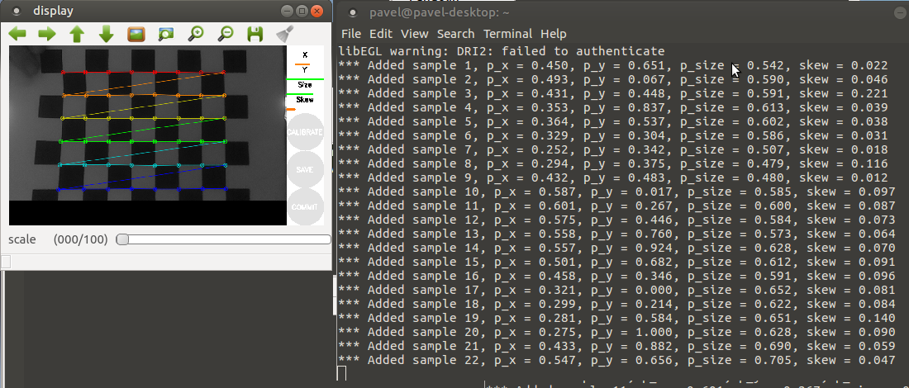<br>
  <em>Figure 19: Camera calibration</em>
</p>

#### 3.4.4 Testing

The vehicle was placed at a random position, and all nodes were started from the UI: ORB-SLAM2, the sensors including the camera, and the Arduino serial node.

**Static test (rotating in place):** ORB-SLAM2 initialized, and turning on the spot produced a rough map of the room. But pure rotation doesn't give the parallax needed to estimate landmark depth, so the result has a lot of error.

<p align="center">
  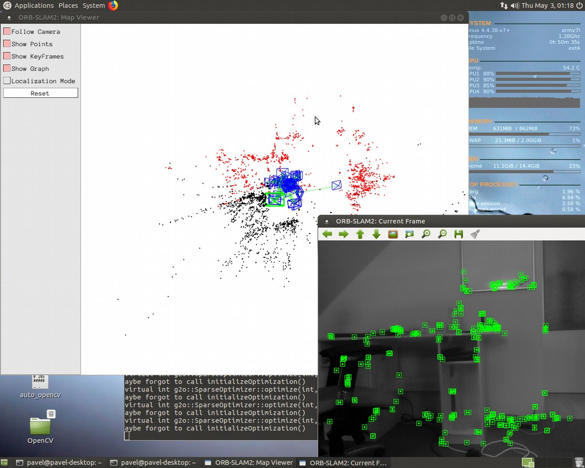<br>
  <em>Figure 20: ORB-SLAM2 static test (rotation around the vehicle's y axis)</em>
</p>

**Small scene:** no problems initializing, and the reconstruction was **very accurate**. Tracking was lost only now and then, during fast turns.

<p align="center">
  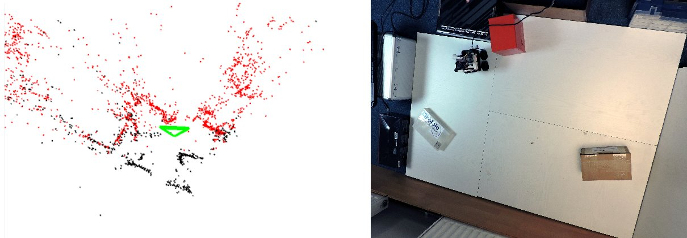<br>
  <em>Figure 21: ORB-SLAM2 example</em>
</p>

**Whole room:** initialization was harder, because of the lighting and the small number of objects in the room. Then the camera mounting turned out to be a problem. It pointed so that much of the view was floor, and the room has a carpet with a busy blue pattern. ORB-SLAM2 latched onto the carpet's features, which badly distorted the map and made it useless. Moving the camera to the **highest point** of the frame and **tilting it slightly up** partly fixed this.

Even so, results were poor in rooms with **few objects** or with **repetitive, similar-looking objects**. Mapping worked in smaller parts of such spaces. Elsewhere, new points were often matched to already-mapped areas, which spoiled the whole map, and after a while tracking was often lost.

<p align="center">
  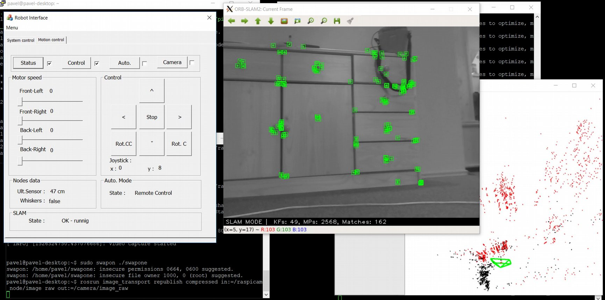<br>
  <em>Figure 22: Manual control with ORB-SLAM2</em>
</p>

## 4. Conclusion

The goal was to design and build a vehicle for mapping small, hard-to-reach spaces, with both manual and autonomous control. The work was split into construction and wiring, manual control, autonomous mode, and mapping and localization.

- **Hardware:** despite early worries about overheating and performance, the **Raspberry Pi** proved good enough. The **Arduino** did its job fully. The motor shield worked as expected, but a newer, more compact version exists. The old one uses bulky through-hole parts, which makes the vehicle taller and raises its center of gravity. The voltage regulator is adequate but would need a heatsink for long-term use.
- **Software:** the sensor nodes were simple (basic arithmetic and GPIO). The autonomous-mode node supports both manual and autonomous control. It's missing a **state machine that manages the SLAM node**: one that initializes mapping and takes over to recover when tracking is lost. The SLAM state is currently only shown in the UI.
- **User interface:** it covers everything remote control needs. However, the video wrapper sometimes **froze the whole application** on a weak Wi-Fi signal. Once the vehicle-side part was in place, the **SSH-based** interface turned out to be almost as capable as Rosbridge.

Each part was tested as it was built. The technologies and approaches used met the project's goals with varying success. The mapping and localization would probably work better with **better sensors**, including in poor lighting.

## Repository layout

```
BP/
├── dokumentace.pdf            # original thesis (Czech)
├── docs/images/               # figures used in this README
└── src/
    ├── Arduino/
    │   └── MotorControl.ino   # ROSSerial node driving the L293D motor shield
    ├── pi_rover/              # ROS package running on the Raspberry Pi
    │   └── src/
    │       ├── auto_mode.cpp        # subsumption-style autonomous control
    │       ├── ult_sensor.cpp       # HC-SR04 ultrasonic sensor node
    │       ├── whiskers_sensor.cpp  # wire bumper node
    │       ├── gui_status.cpp       # ROS → stdout bridge for the UI
    │       └── gui_control.cpp      # stdin → ROS bridge for the UI
    ├── ORB_SLAM2/             # modified ORB-SLAM2 ROS examples (publishes tracking state)
    └── PiInterface/           # Windows MFC remote-control application (libssh + libVLC)
```

## Appendix A – Costs

A side goal was to keep costs down by reusing components already on hand and buying cheap versions of the electronics.

| Component | Price (CZK) |
|---|---:|
| Raspberry Pi 3 | 869 |
| Arduino UNO rev. 3 | 600 |
| Motor shield | 160 |
| Step-down regulator | 100 |
| Camera | 270 |
| Ultrasonic sensor | 45 |
| Logic-level shifter | 30 |
| Wiring and connectors | 50 |
| 3D printing (material) | 100 |
| Motors | 240 |
| **Total** | **2,464 CZK** (≈ €95 at 2018 rates) |

## References

1. DAVISON, Andrew J. *SLAM with a Single Camera.* <https://www.doc.ic.ac.uk/~ajd/Publications/davison_cml2002.pdf>
2. GAUTHAM P., JACOB G. *Real-time ROSberryPi SLAM Robot.* <https://courses.cit.cornell.edu/ece6930/ECE6930_Spring16_Final_MEng_Reports/SLAM/Real-time%20ROSberryPi%20SLAM%20Robot.pdf>
3. DAVISON, Andrew J. et al. *MonoSLAM: Real-Time Single Camera SLAM.* <https://www.doc.ic.ac.uk/~ajd/Publications/davison_etal_pami2007.pdf>
4. NEDUCHAL, Petr. *Návrh a testování metod vizuální simultánní lokalizace a mapování* (Design and testing of visual SLAM methods). <https://otik.uk.zcu.cz/bitstream/11025/7432/1/dp_prace.pdf>
5. BROOKS, Rodney A. *A Robust Layered Control System for a Mobile Robot.* <http://www.dtic.mil/dtic/tr/fulltext/u2/a160833.pdf>
6. MUR-ARTAL, Raúl; MONTIEL, J. M. M.; TARDÓS, Juan D. *ORB-SLAM: a Versatile and Accurate Monocular SLAM System.* <http://webdiis.unizar.es/~raulmur/MurMontielTardosTRO15.pdf>
