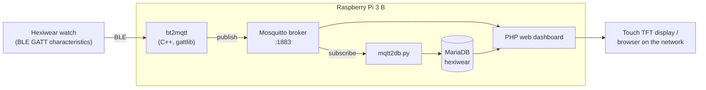

# Demo Application with Hexiwear and Raspberry Pi

**NAV course project** · Brno University of Technology, Faculty of Information Technology · 2019/2020
**Author:** Pavel Koupý

> English adaptation of the original Czech documentation ([`dokumentace.pdf`](dokumentace.pdf)). The text is translated and condensed.

<p align="center">
  <br>
  <em>Figure 1: The demo application: Raspberry Pi with a touch display (left) and the Hexiwear watch (right)</em>
</p>

## Overview

Demo application for the [Hexiwear](https://github.com/MikroElektronika/HEXIWEAR) wearable platform. A **Raspberry Pi** operates as a gateway: it reads sensor data from the watch over **Bluetooth Low Energy**, republishes it on an **MQTT broker**, archives it in a **MariaDB** database and displays it on a web dashboard.

**Keywords:** Hexiwear, Raspberry Pi, Bluetooth Low Energy (BLE), GATT, MQTT, MariaDB, IoT gateway

## Contents

1. [Assignment](#1-assignment)
2. [Implementation](#2-implementation)
   - [2.1 Bluetooth-to-MQTT bridge](#21-bluetooth-to-mqtt-bridge)
   - [2.2 MQTT broker](#22-mqtt-broker)
   - [2.3 Database archiving](#23-database-archiving)
   - [2.4 Visualization](#24-visualization)
   - [2.5 Limitations](#25-limitations)
3. [Conclusion](#3-conclusion)
4. [Repository layout](#repository-layout)
5. [References](#references)

---

## 1. Assignment

*Using the available libraries and development tools, create a simple demo application on the Hexiwear platform.*

Hexiwear hardware:

| Component | Part |
|---|---|
| Microcontroller | **NXP MK64F** (ARM Cortex-M4) |
| Wireless SoC | **NXP MKW40Z**, **BLE 4.1** |
| Sensors | pressure, gyroscope, accelerometer, heart rate, ambient light, others |

The Hexiwear communicates only over Bluetooth. A **Raspberry Pi** (built-in Bluetooth and Wi-Fi) is added as a second platform with the following functions:

- bridges BLE to MQTT, exposing the readings over Wi-Fi or Ethernet;
- runs the MQTT broker;
- archives the Hexiwear readings;
- displays current values and time-series charts in a web interface.



## 2. Implementation

Platform: **Raspberry Pi 3 B** with a **touch TFT display**, acting as the Hexiwear gateway and handling archiving and visualization.

### 2.1 Bluetooth-to-MQTT bridge

The bridge makes the Hexiwear reachable over any network layer (Wi-Fi, Ethernet).

| Component | File | Function |
|---|---|---|
| Main loop | [`src/bt2mqtt.cpp`](src/bt2mqtt.cpp) | reads characteristics, publishes to MQTT |
| BLE access | [`src/bt.cpp`](src/bt.cpp) | [**gattlib**](https://github.com/labapart/gattlib) wrapper; communicates with the Bluetooth module over D-Bus |
| MQTT client | [`src/mqtt.cpp`](src/mqtt.cpp) | **mosquittopp** client wrapper |
| Definitions | [`src/hexiwear.h`](src/hexiwear.h) | GATT characteristic UUIDs (from the Hexiwear Bluetooth specification [2]) and MQTT topics |

| Service | Characteristic | UUID (`0000xxxx-0000-1000-8000-00805f9b34fb`) | MQTT topic |
|---|---|---|---|
| Battery | battery level | `2A19` | `hexiwear/2A19/battery_service/battery_level` |
| App mode | current app | `2041` | `hexiwear/2041/appmode_service/app` |
| Motion | accelerometer | `2001` | `hexiwear/2001/motion_service/accelerometr` |
| Motion | gyroscope | `2002` | `hexiwear/2002/motion_service/gyroscope` |
| Motion | magnetometer | `2003` | `hexiwear/2003/motion_service/magnetometr` |
| Weather | ambient light | `2011` | `hexiwear/2011/weather_service/ambient_light` |
| Weather | temperature | `2012` | `hexiwear/2012/weather_service/temperature` |
| Weather | humidity | `2013` | `hexiwear/2013/weather_service/humidity` |
| Weather | pressure | `2014` | `hexiwear/2014/weather_service/pressure` |
| Health | heart rate | `2021` | `hexiwear/2021/health_service/heart_rate` |
| Health | steps | `2022` | `hexiwear/2022/health_service/steps` |
| Health | calories | `2023` | `hexiwear/2023/health_service/calories` |
| Alert | alert in | `2031` | `hexiwear/2031/alert_service/alert_in` |
| Alert | alert out | `2032` | `hexiwear/2032/alert_service/alert_out` |

*Table 1: Hexiwear characteristic UUIDs and MQTT topics (Figures 2 and 3 in the original)*

Operation of `bt2mqtt`:

1. Connect to the watch by MAC address (constant in `bt2mqtt.cpp`).
2. Read every characteristic in Table 1.
3. Convert the raw bytes to a hex string and publish it to the corresponding topic.
4. Sleep 1 s; repeat from step 2.

Build and run (CMake, [`src/CMakeLists.txt`](src/CMakeLists.txt)). Database archiving ([2.3](#23-database-archiving)) must be started separately.

```sh
cd src && mkdir build && cd build
cmake .. && make
./bt2mqtt
```

### 2.2 MQTT broker

| Item | Value |
|---|---|
| OS | **Raspbian Buster** |
| Dependencies | **mosquittopp** (C++ client library), **gattlib**, MQTT broker |
| Broker | Mosquitto, default port **1883** |
| Topics | created by the bridge on start (Table 1) |
| Payload format | **string holding a hexadecimal number** |

### 2.3 Database archiving

[`scripts/mqtt2db.py`](scripts/mqtt2db.py) archives MQTT data. It is reused from the [SEN 2018/19](../SEN) project [1].

- MQTT client: `paho-mqtt`; subscribes to the Hexiwear topics.
- Storage: MySQL-compatible **MariaDB**, database `hexiwear`; one insert per received message.
- Startup: `@reboot` entry in [`scripts/crontab.txt`](scripts/crontab.txt).

All readings are stored in table `data`:

| Field | Type | Null | Key | Default | Extra |
|---|---|---|---|---|---|
| `id` | int(11) | NO | PRI | NULL | auto_increment |
| `device_id` | int(11) | NO | | NULL | |
| `service_id` | int(11) | NO | MUL | NULL | |
| `time` | timestamp | YES | | current_timestamp() | |
| `value` | varchar(128) | YES | | NULL | |

*Table 2: Structure of the `data` table (Figure 4 in the original)*

Table `service` defines the reading type of each row: data items keyed by UUID, with a description and an optional value offset. `service_id` is the 16-bit UUID from the topic, parsed as hex.

| Field | Type | Null | Key | Default | Extra |
|---|---|---|---|---|---|
| `service_id` | int(11) | NO | PRI | NULL | |
| `name` | varchar(128) | NO | | NULL | |
| `value_offset` | int(11) | NO | | NULL | |
| `description` | varchar(256) | NO | | NULL | |

*Table 3: Structure of the `service` table (Figure 6 in the original)*

Documented archiving rate: one `data` record per service **every 30 seconds**.

> **Note (PDF vs. code):**
> - The bridge loop runs approx. **once per second** (plus BLE read time); `mqtt2db.py` inserts every received message. The 30-second interval corresponds to the dashboard page refresh, not the archiving rate.
> - `mqtt2db.py` writes a `value_offset` column into `data`; the documented `data` schema has no such column.
> - `mqtt2db.py` does not subscribe to the `alert_in` topic.

### 2.4 Visualization

Dashboard built from a **Bootstrap** snippet, served by a web server on the Raspberry Pi (PHP pages in [`web/`](web/)). One page per Hexiwear service, selected from the main menu ([`web/index.php`](web/index.php)).

<p align="center">
  <br>
  <em>Figure 2: Web application – main menu</em>
</p>

| Page | Data source | Content |
|---|---|---|
| **weather** ([`web/weather.php`](web/weather.php)) | MQTT broker (PHP Mosquitto extension), periodic update | sensor readings; forecast banner for Brno ([weatherwidget.io](https://weatherwidget.io/) widget) |
| other pages | MQTT; database for time series | per-service values and history |

<p align="center">
  <br>
  <em>Figure 3: Web application – motion sensors (left) and weather page (right). The tiles read "measured temperature", "pressure", "measured humidity" and "ambient light"; the banner shows the forecast for Brno.</em>
</p>

Data availability constraints (watch side):

- Temperature, humidity and most other sensor characteristics are transmitted only while **"sensor tag" mode** is enabled on the watch.
- Heart rate is transmitted over BLE only while the heart-rate app is open on the watch.

### 2.5 Limitations

- Visualization is incomplete; some values have no dashboard view. All data remains available in the database and on MQTT.
- [`web/health.php`](web/health.php): stub — empty heart-rate chart (CanvasJS), database query marked `todo`.
- [`web/other.php`](web/other.php): unchanged page from the SEN project; uses its water-level topics (`uwls/...`).

## 3. Conclusion

| Component | Status |
|---|---|
| BLE → MQTT bridge (`bt2mqtt`) | complete |
| MQTT → MariaDB archiving (`mqtt2db.py`) | complete; provides data for visualization |
| Web visualization | incomplete |

Recommended alternative for visualization: an existing IoT framework with built-in visualization, e.g. [Home Assistant](https://www.home-assistant.io/).

## Repository layout

```
NAV/
├── dokumentace.pdf          # original documentation (Czech)
├── docs/images/             # figures used in this README
├── src/                     # BLE → MQTT bridge (C++)
│   ├── CMakeLists.txt       # builds the bt2mqtt executable
│   ├── bt2mqtt.cpp          # main loop: read characteristics, publish to MQTT
│   ├── bt.cpp / bt.h        # gattlib wrapper (connect, read/write by UUID)
│   ├── mqtt.cpp / mqtt.h    # mosquittopp client wrapper
│   └── hexiwear.h           # characteristic UUIDs and MQTT topics
├── scripts/
│   ├── mqtt2db.py           # MQTT → MariaDB archiver
│   └── crontab.txt          # starts mqtt2db.py at boot
└── web/                     # PHP dashboard for the touch display
    ├── index.php            # main menu
    ├── weather.php          # weather sensors + forecast widget
    ├── motion.php           # accelerometer, gyroscope, magnetometer
    ├── health.php           # heart rate chart (unfinished)
    ├── other.php            # leftover page from the SEN project
    ├── style.css
    └── jquery.js
```

Key files: [`src/bt2mqtt.cpp`](src/bt2mqtt.cpp), [`src/bt.cpp`](src/bt.cpp), [`src/mqtt.cpp`](src/mqtt.cpp), [`src/hexiwear.h`](src/hexiwear.h), [`scripts/mqtt2db.py`](scripts/mqtt2db.py), [`web/index.php`](web/index.php), [`web/weather.php`](web/weather.php), [`web/motion.php`](web/motion.php).

## References

1. KOUPÝ, Pavel. *SEN 2018/19 project – water level sensor.* (see [`../SEN`](../SEN))
2. MikroElektronika. *HEXIWEAR Bluetooth Specifications* (communication protocol). <https://github.com/MikroElektronika/HEXIWEAR/blob/master/documentation/HEXIWEAR%20Bluetooth%20Specifications.pdf>
3. BlueZ documentation. <https://git.kernel.org/pub/scm/bluetooth/bluez.git/tree/doc>
