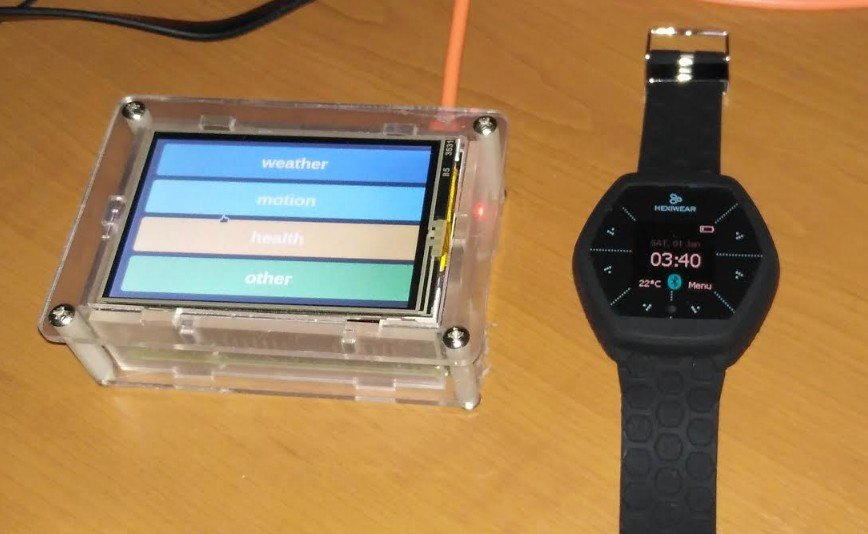
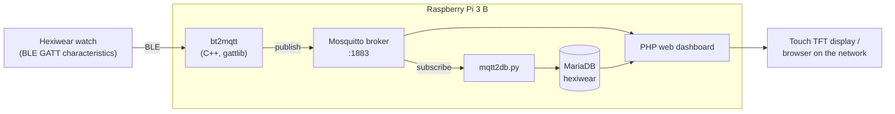
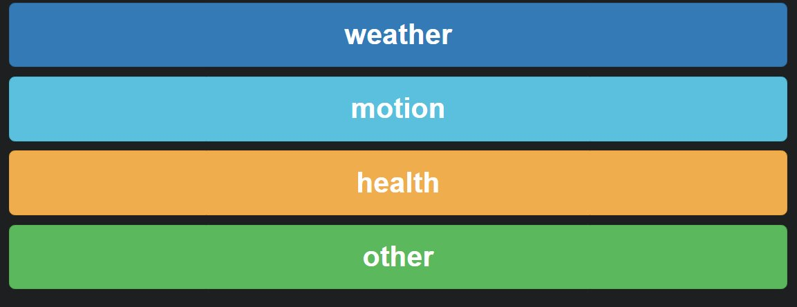
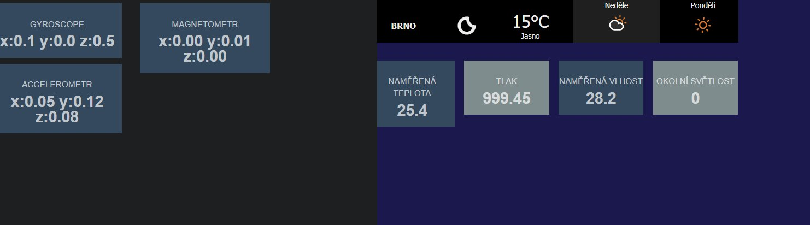

# Demo Application with Hexiwear and Raspberry Pi

**NAV course project** · Brno University of Technology, Faculty of Information Technology · 2019/2020
**Author:** Pavel Koupý

> English adaptation of the original Czech documentation ([`dokumentace.pdf`](dokumentace.pdf)). The text is translated and lightly condensed.

<p align="center">
  <br>
  <em>Figure 1: The demo application: Raspberry Pi with a touch display (left) and the Hexiwear watch (right)</em>
</p>

## Overview

The project is a demo application for the [Hexiwear](https://github.com/MikroElektronika/HEXIWEAR) wearable platform. A **Raspberry Pi** acts as a gateway: it reads sensor data from the watch over **Bluetooth Low Energy**, republishes it on an **MQTT broker**, archives it in a **MariaDB** database and shows it on a small web dashboard.

**Keywords:** Hexiwear, Raspberry Pi, Bluetooth Low Energy (BLE), GATT, MQTT, MariaDB, IoT gateway

## Contents

1. [Assignment](#1-assignment)
2. [Implementation](#2-implementation)
   - [2.1 Bridging Bluetooth to MQTT](#21-bridging-bluetooth-to-mqtt)
   - [2.2 MQTT broker](#22-mqtt-broker)
   - [2.3 Archiving data in a database](#23-archiving-data-in-a-database)
   - [2.4 Visualization](#24-visualization)
   - [2.5 Limitations](#25-limitations)
3. [Conclusion](#3-conclusion)
4. [Repository layout](#repository-layout)
5. [References](#references)

---

## 1. Assignment

*Using the available libraries and development tools, create a simple demo application on the Hexiwear platform.* The key parts of Hexiwear are an **NXP MK64F** microcontroller (ARM Cortex-M4 core), an **NXP MKW40Z** wireless SoC for **BLE 4.1**, and a wide range of sensors (pressure, gyroscope, accelerometer, heart rate, ambient light and more).

The project adds a second platform, the **Raspberry Pi**. It has built-in Bluetooth and Wi-Fi, so it runs the MQTT broker and serves as a gateway for the Hexiwear watch, which can only talk over Bluetooth. The Pi bridges BLE to MQTT, so the readings can be accessed over Wi-Fi or Ethernet. It also keeps a history of the Hexiwear readings and shows them over time, with charts, in a simple web interface.



## 2. Implementation

The implementation uses a **Raspberry Pi 3 B** with a small **touch TFT display**. It acts as the gateway for the Hexiwear and handles visualization and archiving of the watch data.

### 2.1 Bridging Bluetooth to MQTT

Bridging BLE to MQTT makes the Hexiwear reachable over any network layer, such as Wi-Fi or Ethernet.

The bridge is a C++ application ([`src/bt2mqtt.cpp`](src/bt2mqtt.cpp)). It uses the [**gattlib**](https://github.com/labapart/gattlib) library to talk to the Bluetooth module over D-Bus ([`src/bt.cpp`](src/bt.cpp)), and a **mosquittopp** MQTT client ([`src/mqtt.cpp`](src/mqtt.cpp)) to publish the data it reads. The UUIDs of the individual data items (GATT characteristics) come from the Hexiwear Bluetooth specification [2]. They are defined in [`src/hexiwear.h`](src/hexiwear.h), together with the MQTT topic each one is published on:

| Service | Characteristic | UUID (`0000xxxx-0000-1000-8000-00805f9b34fb`) | MQTT topic |
|---|---|---|---|
| Battery | battery level | `2A19` | `hexiwear/2A19/battery_service/battery_level` |
| App mode | current app | `2041` | `hexiwear/2041/appmode_service/app` |
| Motion | accelerometer | `2001` | `hexiwear/2001/motion_service/accelerometr` |
| Motion | gyroscope | `2002` | `hexiwear/2002/motion_service/gyroscope` |
| Motion | magnetometer | `2003` | `hexiwear/2003/motion_service/magnetometr` |
| Weather | ambient light | `2011` | `hexiwear/2011/weather_service/ambient_light` |
| Weather | temperature | `2012` | `hexiwear/2012/weather_service/temperature` |
| Weather | humidity | `2013` | `hexiwear/2013/weather_service/humidity` |
| Weather | pressure | `2014` | `hexiwear/2014/weather_service/pressure` |
| Health | heart rate | `2021` | `hexiwear/2021/health_service/heart_rate` |
| Health | steps | `2022` | `hexiwear/2022/health_service/steps` |
| Health | calories | `2023` | `hexiwear/2023/health_service/calories` |
| Alert | alert in | `2031` | `hexiwear/2031/alert_service/alert_in` |
| Alert | alert out | `2032` | `hexiwear/2032/alert_service/alert_out` |

*Table 1: Hexiwear characteristic UUIDs and MQTT topics (Figures 2 and 3 in the original)*

The bridge is built with **CMake** ([`src/CMakeLists.txt`](src/CMakeLists.txt)) into a `bt2mqtt` executable. It connects to the watch by its MAC address (a constant in `bt2mqtt.cpp`), then loops: it reads every characteristic, converts the raw bytes to a hex string and publishes it to the matching topic, then sleeps for 1 s. Once the bridge is running, database archiving has to be started as well (see [2.3](#23-archiving-data-in-a-database)).

```sh
cd src && mkdir build && cd build
cmake .. && make
./bt2mqtt
```

### 2.2 MQTT broker

The Raspberry Pi runs **Raspbian Buster**. For the project to work it needs the **mosquittopp** (C++ client library), **gattlib** and an MQTT broker (Mosquitto, listening on the default port **1883**). Once the bridge starts, it creates the topics listed in Table 1. Each value is published as a **string holding a hexadecimal number**.

### 2.3 Archiving data in a database

A Python script, [`scripts/mqtt2db.py`](scripts/mqtt2db.py), archives the MQTT data. It was taken over from the author's earlier [SEN 2018/19](../SEN) project [1]. It subscribes to the Hexiwear topics (using `paho-mqtt`) and inserts each message into a MySQL-compatible **MariaDB** database called `hexiwear`. [`scripts/crontab.txt`](scripts/crontab.txt) starts it at boot (`@reboot`).

All readings go into a single table, `data`:

| Field | Type | Null | Key | Default | Extra |
|---|---|---|---|---|---|
| `id` | int(11) | NO | PRI | NULL | auto_increment |
| `device_id` | int(11) | NO | | NULL | |
| `service_id` | int(11) | NO | MUL | NULL | |
| `time` | timestamp | YES | | current_timestamp() | |
| `value` | varchar(128) | YES | | NULL | |

*Table 2: Structure of the `data` table (Figure 4 in the original)*

What kind of reading a row holds is defined by the `service` table. It lists the data items by their UUID (the script stores the 16-bit UUID from the topic, parsed as hex, as `service_id`), with a description and a value offset where one applies:

| Field | Type | Null | Key | Default | Extra |
|---|---|---|---|---|---|
| `service_id` | int(11) | NO | PRI | NULL | |
| `name` | varchar(128) | NO | | NULL | |
| `value_offset` | int(11) | NO | | NULL | |
| `description` | varchar(256) | NO | | NULL | |

*Table 3: Structure of the `service` table (Figure 6 in the original)*

According to the documentation, the `data` table gets a record for each service **every 30 seconds**, as the data is read from the Hexiwear and published to the MQTT topics.

> **Note (from the code):** in the current source the bridge loop runs about **once per second** (plus BLE read time), and `mqtt2db.py` inserts every message it receives. The 30-second interval matches the dashboard's page refresh rather than the archiving rate. The script also writes a `value_offset` column into `data`, which the documented `data` schema does not have, and it does not subscribe to the `alert_in` topic.

### 2.4 Visualization

The visualization is a simple dashboard built from a **Bootstrap** snippet and served by a web server on the Raspberry Pi (PHP pages in [`web/`](web/)). Each page shows one Hexiwear service, named on its button in the main menu ([`web/index.php`](web/index.php)).

<p align="center">
  <br>
  <em>Figure 2: Web application – main menu</em>
</p>

The **weather** page ([`web/weather.php`](web/weather.php)) shows readings from the watch's sensors next to a forecast banner (a [weatherwidget.io](https://weatherwidget.io/) widget for Brno). The values are read from the MQTT broker (via the PHP Mosquitto extension), so they update periodically. Some data items, such as temperature and humidity, only arrive once the **"sensor tag" mode** is switched on in the watch; it then starts sending readings from most sensors on their UUIDs.

<p align="center">
  <br>
  <em>Figure 3: Web application – motion sensors (left) and weather page (right). The tiles read "measured temperature", "pressure", "measured humidity" and "ambient light"; the banner shows the forecast for Brno.</em>
</p>

The other pages read data the same way: from MQTT, as described above, but also from the database when values over time are needed. One small drawback is that some items, such as heart rate, are only sent over BLE while the matching app (here the heart-rate app) is open on the watch.

### 2.5 Limitations

The visualization is not fully finished, and some values do not yet have a working demo. All data is still stored in the database and is available there or on MQTT.

In the code, the **health** page ([`web/health.php`](web/health.php)) is a stub: it has an empty heart-rate chart (CanvasJS) and a `todo` for the database query. The **other** page ([`web/other.php`](web/other.php)) is still the page from the SEN project and uses its water-level topics (`uwls/...`).

## 3. Conclusion

The project demonstrates working with the Hexiwear embedded platform and a Raspberry Pi. The Pi bridges communication from Bluetooth to MQTT, and that part is fully implemented. Archiving the data in a database with the Python script `mqtt2db.py` is also complete; it provides the data for the visualization.

The visualization is not finished. A better option would be an existing IoT framework such as [Home Assistant](https://www.home-assistant.io/), which already has very good visualization.

## Repository layout

```
NAV/
├── dokumentace.pdf          # original documentation (Czech)
├── docs/images/             # figures used in this README
├── src/                     # BLE → MQTT bridge (C++)
│   ├── CMakeLists.txt       # builds the bt2mqtt executable
│   ├── bt2mqtt.cpp          # main loop: read characteristics, publish to MQTT
│   ├── bt.cpp / bt.h        # gattlib wrapper (connect, read/write by UUID)
│   ├── mqtt.cpp / mqtt.h    # mosquittopp client wrapper
│   └── hexiwear.h           # characteristic UUIDs and MQTT topics
├── scripts/
│   ├── mqtt2db.py           # MQTT → MariaDB archiver
│   └── crontab.txt          # starts mqtt2db.py at boot
└── web/                     # PHP dashboard for the touch display
    ├── index.php            # main menu
    ├── weather.php          # weather sensors + forecast widget
    ├── motion.php           # accelerometer, gyroscope, magnetometer
    ├── health.php           # heart rate chart (unfinished)
    ├── other.php            # leftover page from the SEN project
    ├── style.css
    └── jquery.js
```

Key files: [`src/bt2mqtt.cpp`](src/bt2mqtt.cpp), [`src/bt.cpp`](src/bt.cpp), [`src/mqtt.cpp`](src/mqtt.cpp), [`src/hexiwear.h`](src/hexiwear.h), [`scripts/mqtt2db.py`](scripts/mqtt2db.py), [`web/index.php`](web/index.php), [`web/weather.php`](web/weather.php), [`web/motion.php`](web/motion.php).

## References

1. KOUPÝ, Pavel. *SEN 2018/19 project – water level sensor.* (see [`../SEN`](../SEN))
2. MikroElektronika. *HEXIWEAR Bluetooth Specifications* (communication protocol). <https://github.com/MikroElektronika/HEXIWEAR/blob/master/documentation/HEXIWEAR%20Bluetooth%20Specifications.pdf>
3. BlueZ documentation. <https://git.kernel.org/pub/scm/bluetooth/bluez.git/tree/doc>
