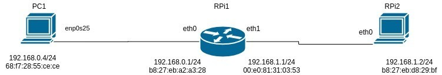
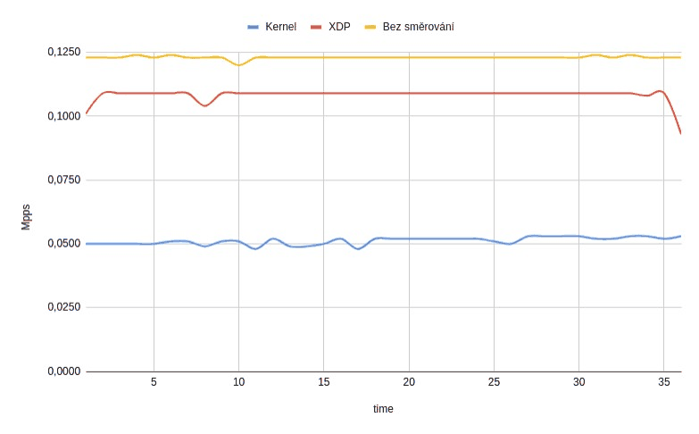

# PDS – Network Stack Throughput Testing

**Course project** · PDS (Data Communications, Computer Networks and Protocols) · Brno University of Technology, Faculty of Information Technology · 2020
**Author:** Pavel Koupý (xkoupy00)

> English adaptation of the original Czech documentation ([`dokumentace.pdf`](dokumentace.pdf)). The text is translated and lightly condensed. The Czech setup notes in [`linux/`](linux) are translated in [Appendix A](#appendix-a--setup-notes).

## Overview

This project compares two ways of routing packets on a **Raspberry Pi 3**: the regular Linux network stack (kernel IP forwarding) and **XDP** (eXpress Data Path), which processes packets in an eBPF program before the kernel allocates its usual packet structures. The packet rate was measured for three scenarios: kernel forwarding, XDP redirect, and a direct link without routing as a baseline. On this hardware XDP forwarded about twice as many packets per second as the kernel stack. That is close to the rate of the direct link.

**Keywords:** XDP, eBPF, packet forwarding, Linux network stack, Raspberry Pi, throughput, packets per second

## Contents

1. [Refined assignment](#1-refined-assignment)
2. [XDP technology](#2-xdp-technology)
3. [Methodology](#3-methodology)
   - [3.1 Topology](#31-topology)
   - [3.2 Scenarios](#32-scenarios)
4. [Hardware and environment](#4-hardware-and-environment)
5. [Measurements](#5-measurements)
6. [Conclusion](#6-conclusion)
7. [Repository layout](#repository-layout)
8. [Appendix A – Setup notes](#appendix-a--setup-notes)
9. [References](#references)

---

## 1. Refined assignment

The project looks at the difference between routing packets with the Linux network stack and routing them with XDP, and at what that means on a Raspberry Pi 3 single-board computer. XDP was designed to speed up dedicated routers with network interfaces running at tens of Gbps or more. The question here is how much it can help on a quad-core ARM board whose Ethernet chip is attached over USB. Both the built-in Ethernet port and an external USB Ethernet adapter are used.

## 2. XDP technology

eXpress Data Path makes it possible to process a packet at a very low level, often directly in the network device driver. This avoids allocating the `sk_buff` structure, which the kernel otherwise needs for any further work with the packet.

XDP [2, 3] is tied to the Berkeley Packet Filter, specifically extended BPF (eBPF). It can dynamically load and run verified XDP bytecode deep in the kernel, attached to a network hook (here the XDP hook). An in-kernel Just-In-Time compiler translates the BPF bytecode into native opcodes.

An XDP program returns an action that decides what happens to the packet next:

| Action | Effect | Typical use |
|---|---|---|
| `XDP_PASS` | Hands the packet to the regular network stack | Normal processing |
| `XDP_REDIRECT` | Redirects the packet to another interface | Forwarding / routing (used in this project) |
| `XDP_TX` | Sends the packet back out of the interface it came in on | Load balancing |
| `XDP_DROP` | Drops the packet | Firewalls, DDoS mitigation |

## 3. Methodology

The throughput of a network node can be measured in bits per second (bps) or in packets per second (pps). The packet rate usually describes the packet-processing capacity of a system better. In this project, which focuses on the Raspberry Pi, the packet rate shows how fast the kernel handles packets. Bit rates, which today reach hundreds of Mbps up to Gbps, mostly reflect the speed of the network cards themselves.

The measurement uses the simple code from the article *How to receive a million packets* [1]. It has two parts. The **sender** sends a chosen number of UDP packets with a chosen payload to a given address and port. The **receiver** receives them and prints how many packets it processes. That output was used to draw the graph in [Section 5](#5-measurements). (The sender/receiver code is not part of this repository.)

### 3.1 Topology

The topology is simple and consists of three Linux nodes. One Raspberry Pi acts as the router (**RPi1**), a second one as the capturing device (**RPi2**), and a personal computer (**PC1**) as the traffic generator.

<p align="center">
  <br>
  <em>Figure 1: Topology used</em>
</p>

| Node | Interface | IP address | MAC address |
|---|---|---|---|
| PC1 | `enp0s25` | 192.168.0.4/24 | `68:f7:28:55:ce:ce` |
| RPi1 | `eth0` (built-in) | 192.168.0.1/24 | `b8:27:eb:a2:a3:28` |
| RPi1 | `eth1` (USB adapter) | 192.168.1.1/24 | `00:e0:81:31:03:53` |
| RPi2 | `eth0` | 192.168.1.2/24 | `b8:27:eb:d8:29:bf` |

### 3.2 Scenarios

The measurement was done in three scenarios:

1. **Kernel forwarding.** RPi2 gets a static route to the 192.168.0.0/24 network and then runs the UDP receiver, so it captures the packets. RPi1 is the router. Routing in the Linux kernel requires turning on `ip_forward`. PC1 generates the UDP packets and also gets a static route to the receiver's network, 192.168.1.0/24.
2. **XDP with `bpf_redirect()`.** The topology is the same as in scenario 1, but IP forwarding is turned off. An XDP program catches all packets and statically redirects them to the outgoing interface, rewriting the destination MAC address to a constant value. See [`src/xdp/xdp_prog_kern.c`](src/xdp/xdp_prog_kern.c).
3. **No routing (direct link).** This is mainly a reference for the processing speed of the Linux network stack. It shows how fast the Raspberry Pi can receive data with no routing involved. PC1 is again the generator, and RPi1 is the receiver.

UDP is convenient here because replies and acknowledgements don't need to be routed back, and no connection state is created. This makes it possible to use the simple static-redirect example from the XDP tutorial [3]. The test only counts packets sent from one process to another. The variable under test is the routing technology on the Raspberry Pi in the router role.

Each packet carries a **32-byte payload**, which makes **74 bytes** on Ethernet, and packets are sent in batches of **1024**.

#### XDP program

[`src/xdp/xdp_prog_kern.c`](src/xdp/xdp_prog_kern.c) is based on the *packet03 – redirecting packets* lesson of the xdp-tutorial [3]. It has three program sections:

| Section | Function | Behaviour |
|---|---|---|
| `xdp_eth` | `xdp_redirect_funcc` | Sets destination MAC to `b8:27:eb:d8:29:bf` (RPi2) and calls `bpf_redirect(3, 0)`. Attached to RPi1 `eth0`, it forwards PC1 → RPi2. |
| `xdp_usb` | `xdp_redirect_func` | Sets destination MAC to `68:f7:28:55:ce:ce` (PC1) and calls `bpf_redirect(2, 0)`. This is the reverse direction, for the USB interface. |
| `xdp_pass` | `xdp_pass_func` | Returns `XDP_PASS` only. |

The redirecting sections only parse the Ethernet header (including up to 4 VLAN tags) and count every action in a per-CPU array map, `xdp_stats_map`. The interface indexes (2 and 3) are hard-coded and match RPi1's `eth0` and `eth1`.

## 4. Hardware and environment

| Device | CPU | RAM | Network |
|---|---|---|---|
| Raspberry Pi 3 Model B V1.2 (RPi1, RPi2) | 4-core ARMv8 Cortex-A53, 1.2 GHz | 1 GB | 10/100 Mbps Ethernet connected over USB |
| PC1 | 4-core Intel Core i5-5200U, 2.2 GHz | 8 GB | 10/100 Mbps Ethernet connected over PCI |

The Raspberry Pis run **Raspbian Buster**, the standard image published by the Raspberry Pi developers. To use XDP, the kernel (**v4.19.114-v7**) has to be rebuilt with support for loading and translating BPF bytecode. It can be built on the Raspberry Pi itself or cross-compiled on a PC. The following options need to be turned on in the kernel configuration:

- **XDP sockets** in the networking options (not strictly needed for this measurement),
- the **BPF framework** and the `bpf()` system call,
- the **BPF Just-In-Time compiler**.

Then the kernel is rebuilt along with the parts it needs: `zImage` (the kernel image), the modules, and the Device Tree Blobs that describe the hardware. The exact steps are in [Appendix A](#appendix-a--setup-notes).

## 5. Measurements

The graph below compares XDP with regular forwarding through the Linux network stack and with the direct link.

<p align="center">
  <br>
  <em>Figure 2: Packet processing rate (Mpps) over time. Blue: kernel forwarding, red: XDP, yellow: "Bez směrování" = no routing (direct link)</em>
</p>

Approximate steady-state values read from the graph:

| Scenario | Packet rate |
|---|---|
| 1 – Kernel forwarding | ≈ 0.050 Mpps |
| 2 – XDP redirect | ≈ 0.109 Mpps |
| 3 – No routing (direct link) | ≈ 0.123 Mpps |

The results can be compared with the theoretical maximum. `iperf` measured the real link throughput at **95 Mbps**. With 74-byte UDP packets this gives a theoretical maximum of about **0.158 Mpps**. The direct link should come closest to this value, and it does reach about 0.125 Mpps. The XDP rate is very similar.

## 6. Conclusion

The project used an XDP program, placed between the network interface and the system's packet processing, to improve throughput. According to the measurements, XDP forwards packets through the Raspberry Pi faster than the Linux network stack does. Its rate was similar to the direct link without routing, which is the maximum rate without further system tuning. Such tuning is possible and would probably increase the packet rate further.

However, the XDP program used here is not suitable for real routing. Proper routing would need BPF maps holding the forwarding information. Those maps would be filled either from a first, slow pass of a packet through the kernel stack or from static routes set by the user.

## Repository layout

```
PDS/
├── dokumentace.pdf             # original documentation (Czech)
├── docs/images/                # figures used in this README
├── linux/                      # setup notes (Czech), translated in Appendix A
│   ├── kernel_forwarding.txt   # IP forwarding, iptables and static routes
│   ├── preklad_konfigurace_kernel.txt  # building the Raspberry Pi kernel
│   └── xdp.txt                 # loading/unloading the XDP program
└── src/
    ├── xdp/
    │   ├── xdp_prog_kern.c     # XDP redirect programs (sections xdp_eth, xdp_usb, xdp_pass)
    │   └── Makefile            # builds xdp_prog_kern.o via common.mk
    ├── common/                 # build rules and helpers from xdp-tutorial (common.mk, parsing helpers, ...)
    ├── headers/                # BPF / kernel UAPI headers from xdp-tutorial
    └── libbpf/                 # vendored copy of libbpf (third-party)
```

Key files: [`src/xdp/xdp_prog_kern.c`](src/xdp/xdp_prog_kern.c), [`src/xdp/Makefile`](src/xdp/Makefile), [`src/common/common.mk`](src/common/common.mk).

`src/common`, `src/headers` and the build system come from the xdp-tutorial [3]. `src/libbpf` is a vendored copy of the third-party [libbpf](https://github.com/libbpf/libbpf) library. Running `make` in `src/xdp` (with `clang`/`llc` installed and libbpf built) produces only the BPF object `xdp_prog_kern.o`. The `xdp_loader` tool used in Appendix A is not built here; it comes from the xdp-tutorial repository.

## Appendix A – Setup notes

Translated from the Czech notes in [`linux/`](linux). Commands are kept exactly as in the source.

### A.1 Building the kernel with BPF/XDP support

From [`linux/preklad_konfigurace_kernel.txt`](linux/preklad_konfigurace_kernel.txt). This is a native build on a Raspberry Pi 3 (32-bit `kernel7`):

```bash
# build dependencies
sudo apt install git bc bison flex libssl-dev make
sudo apt install libncurses5-dev
# Raspberry Pi kernel sources
git clone --depth=1 https://github.com/raspberrypi/linux
cd linux
KERNEL=kernel7
make bcm2709_defconfig
# enable XDP sockets, BPF, the bpf() syscall and the BPF JIT (see Section 4)
make menuconfig

# build kernel image, modules and device tree blobs, then install them
make -j4 zImage modules dtbs
sudo make modules_install
sudo cp arch/arm/boot/dts/*.dtb /boot/
sudo cp arch/arm/boot/dts/overlays/*.dtb* /boot/overlays/
sudo cp arch/arm/boot/dts/overlays/README /boot/overlays/
sudo cp arch/arm/boot/zImage /boot/$KERNEL.img
```

### A.2 Kernel forwarding (scenario 1)

From [`linux/kernel_forwarding.txt`](linux/kernel_forwarding.txt):

```bash
# enable IPv4 forwarding on the router
echo 1 > /proc/sys/net/ipv4/ip_forward

# allow forwarding between the two interfaces
iptables -A FORWARD -i enp0s25 -o enx00e081310353 -j ACCEPT
iptables -A FORWARD -i enx00e081310353 -o enp0s25 -m state --state ESTABLISHED,RELATED -j ACCEPT

# static routes on the end hosts (sender and receiver)
sudo ip route add 192.168.1.0/24 via 192.168.0.1
sudo ip route add 192.168.0.0/24 via 192.168.1.1
```

`enx00e081310353` is the predictable name of the USB Ethernet adapter with MAC `00:e0:81:31:03:53` (RPi1 `eth1` in Figure 1).

### A.3 Loading the XDP program (scenario 2)

From [`linux/xdp.txt`](linux/xdp.txt). The XDP tutorial includes a loader for XDP programs that can also create BPF maps:

```bash
sudo ./xdp_loader -A -F -d eth0 --filename xdp_prog_kern.o --progsec xdp_eth
```

Alternatively, use iproute2. It cannot create maps or work with the BPF filesystem:

```bash
ip link set dev lo xdpgeneric obj xdp_prog_kern.o sec xdp_eth
```

Unloading the program:

```bash
sudo ip link set dev eth0 xdpgeneric off
```

## References

1. Cloudflare Blog. *How to receive a million packets per second.* <https://blog.cloudflare.com/how-to-receive-a-million-packets/>
2. IO Visor Project. *XDP – eXpress Data Path.* <https://www.iovisor.org/technology/xdp>
3. xdp-project. *XDP tutorial.* <https://github.com/xdp-project/xdp-tutorial>
4. Suchakra Sharma. *An entertaining eBPF XDP adventure.* <https://suchakra.wordpress.com/2017/05/23/an-entertaining-ebpf-xdp-adventure/>
5. FIT BUT, PDS course. *Zpracování paketů* (Packet processing), lecture slides. <https://wis.fit.vutbr.cz/FIT/st/cfs.php.cs?file=%2Fcourse%2FPDS-IT%2Flectures%2Fpds-zpracovani-paketu.pdf&cid=13440>
