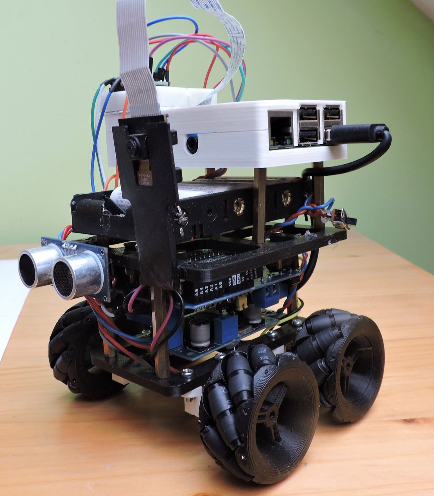

# school_projects

A selection of the most interesting projects from my studies at **Brno University of Technology, Faculty of Information Technology (VUT FIT)**. They range from robotics and computer vision to embedded IoT devices and Linux networking, and they include my bachelor's thesis.

Each project has its own English README, adapted from the original Czech documentation (`dokumentace.pdf` in each folder).

<p align="center">
  
</p>

## Projects

| Project | Year | Summary | Tech |
|---|---|---|---|
| [**BP** – Vehicle for Small and Remote Space Mapping](BP/README.md) | 2018 | Bachelor's thesis. A 3D-printed robot on Mecanum wheels that explores a room autonomously (subsumption architecture) and builds a 3D map with a single camera using ORB-SLAM2, controlled from a Windows app over SSH. | Raspberry Pi, Arduino, ROS, ORB-SLAM2, OpenCV, C++, MFC |
| [**NAV** – Hexiwear and Raspberry Pi Gateway](NAV/README.md) | 2019/2020 | A Raspberry Pi gateway for the Hexiwear wearable. It bridges the watch's Bluetooth LE sensor data to MQTT, archives it in MariaDB and shows it on a small PHP web dashboard on a touchscreen. | Raspberry Pi, Hexiwear, BLE, MQTT, MariaDB, PHP, C++, Python |
| [**PDS** – Network Stack Throughput Testing](PDS/README.md) | 2020 | Compares Linux kernel IP forwarding with an XDP/eBPF `bpf_redirect()` program on a Raspberry Pi 3 router. Measured in packets per second, XDP is about twice as fast and close to a direct link. | Linux kernel, XDP, eBPF, libbpf, C |
| [**SEN** – Water Level Sensor](SEN/README.md) | 2018/2019 | A solar-powered ESP32 ultrasonic water-tank level sensor. It publishes level, volume, temperature and humidity over MQTT to a Raspberry Pi server with a PHP dashboard, and can switch two 230 V relays. | ESP32, MQTT, Mosquitto, MySQL, PHP, Python, 3D printing |
| [**SIN** – Open-Source IoT Tools](SIN/README.md) | 2018/2019 | A survey of open-source IoT frameworks (ThingsBoard, DeviceHive, Freedomotic) and a ThingsBoard home-automation demo. ESP32/ESP8266 devices (a DHT11 sensor, a relay-driven A/C unit and a WS2811 LED matrix) are controlled from a Raspberry Pi touchscreen dashboard. | ThingsBoard, ESP32, ESP8266, MQTT, Raspberry Pi |

## Repository layout

```
school_projects/
├── BP/    # bachelor's thesis – mapping robot (ROS, ORB-SLAM2)
├── NAV/   # Hexiwear BLE → MQTT gateway on Raspberry Pi
├── PDS/   # XDP vs. kernel forwarding benchmark
├── SEN/   # ESP32 solar water-level sensor
└── SIN/   # IoT frameworks survey + ThingsBoard demo
```

Each folder contains `README.md` (English write-up), `dokumentace.pdf` (original Czech documentation), `docs/images/` (figures) and `src/` (source code).

## License

See [LICENSE](LICENSE).
