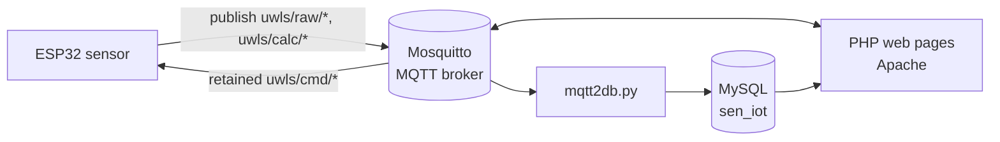

# Water Level Sensor

**SEN course project** · Brno University of Technology, Faculty of Information Technology · 2018/2019
**Author:** Pavel Koupý

> English adaptation of the original Czech project documentation ([`dokumentace.pdf`](dokumentace.pdf)) and Raspberry Pi install notes ([`instalace_rpi.txt`](instalace_rpi.txt)). The text is translated and condensed. Details missing from the PDF are taken from the source code.

<p align="center">
  <br>
  <em>Figure 1: Hardware. From left: open sensor housing with ESP32 and Li-Po battery; housing with ultrasonic sensor mount; top cover with solar panel; 230 V switching module with Superseal connector and socket.</em>
</p>

## Overview

Battery-powered tank water level sensor based on an **ESP32** and an **HC-SR04 ultrasonic distance sensor**. Measurements are published to an **MQTT broker** on a Raspberry Pi, stored in MySQL and displayed by PHP pages. Firmware identifier: **UWLS** (ultrasonic water level sensor).

Additional functions:

- air temperature and humidity measurement (DHT11),
- switching of two 230 V AC loads (relay module),
- solar battery charging,
- configurable tank dimensions (manual entry or calibration).

## Contents

1. [Hardware](#1-hardware)
   - [1.1 Parts list](#11-parts-list)
   - [1.2 Wiring](#12-wiring)
2. [Software](#2-software)
   - [2.1 ESP32 firmware](#21-esp32-firmware)
   - [2.2 Server](#22-server)
   - [2.3 Visualization](#23-visualization)
   - [2.4 Calibration](#24-calibration)
3. [Raspberry Pi setup](#3-raspberry-pi-setup)
4. [Conclusion](#4-conclusion)
5. [Repository layout](#repository-layout)
6. [References](#references)

---

## 1. Hardware

| Function | Implementation |
|---|---|
| Distance measurement | Ultrasonic ping (HC-SR04) |
| Ambient sensing | DHT11 temperature/humidity |
| Load switching | Separate 2-channel 230 V AC module, connected via a waterproof **Superseal** connector (intended loads: e.g. irrigation pump, tank refill valve) |
| Power | 3.7 V Li-Po, solar charged |

Weather protection:

- Top cover with solar panel overhangs the body and is sloped to shed water.
- All cables exit through the bottom, sealed with rubber grommets and hot glue.
- The ultrasonic sensor is splash-resistant at most; the assembly is not rated for outdoor use.

Enclosure:

- Sensor housing: 3D-printed, **PLA**, **0.35 mm** layer height, no supports (models in [`model_tisk/`](model_tisk)).
- Switching module: generic off-the-shelf prototyping enclosure.

### 1.1 Parts list

| Unit | Components |
|---|---|
| **Sensor** | ESP WROOM32 · HC-SR04 ultrasonic sensor · DHT11 temperature/humidity sensor · bidirectional 3.3 V / 5 V logic-level shifter · TP4056 charger · MT3608 step-up converter · 6 V 0.6 W solar panel · 3.7 V 900 mAh Li-Po battery · ZY6.8 Zener diode · 4.7 kΩ resistor |
| **Server** | Raspberry Pi · 3.2" TFT touch display |
| **230 V switching module** | 2-channel 12 V relay module · MT3608 step-up converter · waterproof two-pin socket |

### 1.2 Wiring

<p align="center">
  <br>
  <em>Figure 2: Wiring diagram. Czech labels: "solární panel" = solar panel, "Baterie 3.7V" = 3.7 V battery, "Obousměrný převod. log. úrov. 3V3/5V" = bidirectional 3.3 V/5 V logic-level shifter, "2-kan. relé 12V" = 2-channel 12 V relay.</em>
</p>

ESP32 pin assignment (from [`senzor.ino`](src/senzor/senzor.ino)):

| GPIO | Connected to |
|---|---|
| 25 | HC-SR04 Trigger |
| 33 | HC-SR04 Echo (through the level shifter) |
| 32 | DHT11 data (4.7 kΩ pull-up) |
| 26 | Relay IN1; also calibration buzzer/LED (Superseal pin 4) |
| 27 | Relay IN2 (Superseal pin 3) |

Superseal connector (sensor ↔ switching module):

| Pin | Signal |
|---|---|
| 1 | GND |
| 2 | 5 V |
| 3 | GPIO27 |
| 4 | GPIO26 |

The module's MT3608 boosts 5 V to 12 V for the relay coils.

## 2. Software

Three components: sensor firmware, server services, and data visualization/processing.


<p align="center"><em>Figure 3: Data flow (all server components run on the Raspberry Pi)</em></p>

### 2.1 ESP32 firmware

- Source: [`senzor.ino`](src/senzor/senzor.ino); toolchain: **Arduino IDE** with the **ESP32-Arduino** core.
- MQTT client: [PubSubClient](https://github.com/knolleary/pubsubclient).
- Power strategy: **deep sleep** between measurement cycles.

Wake-up cycle:

1. Connect to Wi-Fi and the MQTT broker; subscribe to command topics.
2. Read temperature and humidity from the DHT11. The **DHTesp** library derives **heat index** and **dew point**; these are approximate, since the formula assumes a fixed barometric pressure (no pressure sensor present).
3. Measure distance to the water surface: `duration × 0.034 / 2` [cm].
4. Compute water volume and fill level from the calibrated tank dimensions (see [Calibration](#24-calibration)).
5. Publish all values as retained messages.
6. Process incoming commands for ~10 s (200 × 50 ms), then enter deep sleep.

| Condition | Sleep period |
|---|---|
| Normal | **60 s** |
| Any measured/computed value invalid | **300 s**; `UWLS ERROR` published to `uwls/debug` |

Commands are sent as **retained** messages so the sensor receives them on its next wake-up.

| Topic | Direction | Content |
|---|---|---|
| `uwls/raw/temp` | sensor → | temperature [°C] |
| `uwls/raw/humid` | sensor → | relative humidity [%] |
| `uwls/raw/dist` | sensor → | distance from sensor to water surface [cm] |
| `uwls/calc/heatIndex` | sensor → | heat index [°C] |
| `uwls/calc/dewPoint` | sensor → | dew point [°C] |
| `uwls/calc/volume` | sensor → | water volume [l] |
| `uwls/calc/tankLevel` | sensor → | fill level [%] |
| `uwls/debug` | sensor → | status/debug messages |
| `uwls/cmd/relay1`, `uwls/cmd/relay2` | → sensor | `1` = relay on, otherwise off |
| `uwls/cmd/width`, `uwls/cmd/height` | → sensor | `1` followed by the tank diameter / height, saved to flash |
| `uwls/cmd/calibration` | → sensor | `1` = start calibration |

Volume (cylindrical tank): *V* = π · *d*² / 4 · (*h*<sub>tank</sub> − *distance*), converted from cm³ to litres.

### 2.2 Server

Platform: Raspberry Pi, **Raspbian**, with **Mosquitto** (MQTT broker), **Apache** + **PHP**, and **MySQL**. None are part of the base image; installation is described in [Raspberry Pi setup](#3-raspberry-pi-setup).

MQTT → MySQL bridge: [`mqtt2db.py`](src/mqtt2db/mqtt2db.py)

- Client library: [Eclipse Paho](https://www.eclipse.org/paho/clients/python/docs/).
- Started at boot by an `@reboot` cron entry ([`crontab.txt`](src/mqtt2db/crontab.txt)).
- Subscribes to `uwls/raw/*` and `uwls/calc/*` in an endless loop; inserts every message into the database.
- The first topic segment is resolved by name in the `sensor` table; a row named `uwls` must exist.

### 2.3 Visualization

Pages in [`src/web/`](src/web) are served by Apache/PHP, read live values via [Mosquitto-PHP](https://github.com/mgdm/Mosquitto-PHP) and historical data from MySQL. Layout targets the Pi's 3.2" touch display; styling is demo-grade, based on modified [Bootstrap snippets](https://bootsnipp.com).

| Page | Content |
|---|---|
| [`index.php`](src/web/index.php) | Menu: weather sensor, level sensor, statistics, settings |
| [`sensor_dht11.php`](src/web/sensor_dht11.php) | Temperature, heat index, humidity and dew point, plus a weather-forecast widget |
| [`sensor_uwls.php`](src/web/sensor_uwls.php) | Water volume, measured distance, fill-level bar, minimum and average volume from the database, and buttons to toggle the two relays |
| [`stats.php`](src/web/stats.php) | Chart of temperature, humidity and water volume over time (CanvasJS) |
| [`setting.php`](src/web/setting.php) | Enter tank height and diameter, start calibration, open the on-screen keyboard |

<p align="center">
  <br>
  <em>Figure 4: Web interface. Top: level sensor page ("Množství vody" = water volume, "Výška hladiny" = level/distance, "Minimální/Průměrný stav" = minimum/average, "Relé" = relay), weather sensor page ("Naměřená teplota" = measured temperature, "Pocitová teplota" = feels-like temperature, "Naměřená vlhkost" = measured humidity, "Rosný bod" = dew point) and the main menu. Bottom: statistics and settings ("Výška nádrže" = tank height, "Průměr/šířka nádrže" = tank diameter/width, "Uložit" = save, "Kalibrace" = calibrate, "Klávesnice" = keyboard, "Zpět" = back).</em>
</p>

### 2.4 Calibration

Triggered from the settings page. Progress is signalled by an LED or piezo buzzer on the Superseal connector, pin 4 (data) to pin 1 (GND).

| Step | Signal / action |
|---|---|
| 1 | Calibration request detected on wake-up: **two beeps** |
| 2 | **10 s** window: sensor aimed across the tank to measure **diameter** |
| 3 | Diameter captured: **one long beep** |
| 4 | **10 s** window: sensor returned to normal position to measure **empty tank height** |
| 5 | Calibration complete: **two beeps** |

Results are stored in flash (SPIFFS: `/calibration_width.txt`, `/calibration_height.txt`), loaded on every wake-up and used for volume and fill-level computation. Both values can alternatively be entered manually on the settings page.

> **Note (from the code):** connector pin 4 is GPIO26, which also drives relay 1; with the switching module connected, the calibration signal drives the relay input.

## 3. Raspberry Pi setup

Source: [`instalace_rpi.txt`](instalace_rpi.txt). Commands are reproduced as in the original; passwords are replaced by placeholders.

### Mosquitto MQTT broker

```bash
wget http://repo.mosquitto.org/debian/mosquitto-repo.gpg.key
sudo apt-key add mosquitto-repo.gpg.key

cd /etc/apt/sources.list.d/
sudo wget http://repo.mosquitto.org/debian/mosquitto-stretch.list
sudo apt-get update
sudo apt-get install mosquitto mosquitto-clients mosquitto-dev
```

Password setup:

```bash
sudo service mosquitto stop

sudo mosquitto_passwd -c /etc/mosqruitto/passwd

# run again
sudo mosquitto -c /etc/mosquitto/passwd
```

> Errata in the original notes: `/etc/mosqruitto/` should be `/etc/mosquitto/`; `mosquitto -c` expects a configuration file. Correct procedure: set `password_file` in `/etc/mosquitto/mosquitto.conf` to the password file and restart the service.

### Environment

```bash
sudo apt-get install chromium-browser
sudo apt-get install apache2
sudo apt-get install php libapache2-mod-php
```

### PHP Mosquitto client (web)

```bash
sudo apt-get install php-pear
sudo apt-get install php-dev
sudo apt-get install libmosquitto-dev
sudo pecl install Mosquitto-alpha

cd /etc/php/7.0/mods-available
sudo nano mosquitto.ini
#   - add "extension=mosquitto.so"

sudo phpenmod mosquitto
sudo service apache2 restart
```

### Python Paho client (`mqtt2db` script)

Empty in the original notes. Requirements derived from the script imports (`paho.mqtt.client`, `mysql.connector`):

1. Install `paho-mqtt` and `mysql-connector-python`.
2. Copy the script to `/home/pi/mqtt2db.py`.
3. Add the line from [`crontab.txt`](src/mqtt2db/crontab.txt) via `crontab -e`.

### Database

```bash
sudo apt install mysql-server php-mysql
```

```sql
DROP USER 'root'@'localhost';
CREATE USER 'root'@'localhost' IDENTIFIED BY '<password>';
GRANT ALL PRIVILEGES ON *.* TO 'root'@'localhost'

create database sen_iot;
create table sen_iot.sensor(
   id INT NOT NULL AUTO_INCREMENT,
   name VARCHAR(100) NOT NULL,
   type INT NOT NULL,
   refresh_rate INT NOT NULL,
   place VARCHAR(100),
   PRIMARY KEY ( id )
);

create table sen_iot.data(
    id INT NOT NULL AUTO_INCREMENT,
    sensor_id INT NOT NULL,
    quantity_type VARCHAR(40) NOT NULL,
    quantity VARCHAR(40) NOT NULL,
    value INT NOT NULL,
    time DATETIME DEFAULT CURRENT_TIMESTAMP,
    PRIMARY KEY ( id ),
    FOREIGN KEY (sensor_id) REFERENCES sensor(id)
);
```

Topic-to-column mapping in `mqtt2db.py` (example `uwls/raw/temp`):

| Topic segment | Column |
|---|---|
| `uwls` | `sensor_id` (lookup by `sensor.name`) |
| `raw` / `calc` | `quantity_type` |
| `temp` | `quantity` |

### Configuration

Wi-Fi, MQTT and database credentials are hard-coded in:

- [`senzor.ino`](src/senzor/senzor.ino): `WIFI_*`, `MQTT_*`; `MQTT_SERVER` must be the Pi's IP address, not `localhost`,
- [`mqtt2db.py`](src/mqtt2db/mqtt2db.py),
- the PHP pages in [`src/web/`](src/web).

## 4. Conclusion

Status:

- Sensor is functional; all assignment requirements are met, some features at demonstration level only.
- Housing and several other parts are insufficiently tested.

Known limitations and proposed improvements:

- **Wi-Fi credentials are static.** Proposed: runtime configuration, e.g. over Bluetooth from an Android device (existing apps support this).
- **Ultrasonic sensor is not weatherproof.** Requires further design iterations for outdoor use; alternative: waterproof **JSN-SR04T** (minimum range ~20 cm).
- **Custom server stack.** For production use, an existing open **IoT framework** with built-in management and visualization is more suitable.

## Repository layout

```
SEN/
├── dokumentace.pdf            # original documentation (Czech)
├── instalace_rpi.txt          # Raspberry Pi install notes (Czech)
├── docs/images/               # figures used in this README
├── model_tisk/                # 3D-printable parts (STL)
│   ├── 3Dmodel.zip            # archive with a subset of the STL files
│   ├── pouzdro_telo.stl       # housing body
│   ├── pouzdro_vrch.stl       # housing top cover (solar panel)
│   ├── uchyt_*.stl            # mount parts
│   ├── ukotveni_spodek.stl    # anchoring base
│   ├── ult_drzak.stl          # ultrasonic sensor holder
│   └── ult_sensor_*.STL, ult_telo_*.STL  # ultrasonic sensor enclosure parts
└── src/
    ├── senzor/
    │   └── senzor.ino         # ESP32 firmware (measurement, MQTT, deep sleep, calibration)
    ├── mqtt2db/
    │   ├── mqtt2db.py         # MQTT → MySQL bridge
    │   └── crontab.txt        # @reboot entry that starts the bridge
    └── web/                   # PHP demo pages for the Pi's touch display
        ├── index.php          # menu
        ├── sensor_dht11.php   # temperature/humidity page
        ├── sensor_uwls.php    # water level page + relay control
        ├── stats.php          # history chart
        ├── setting.php        # tank size and calibration
        ├── style.css
        └── jquery.js
```

Key files: [`senzor.ino`](src/senzor/senzor.ino), [`mqtt2db.py`](src/mqtt2db/mqtt2db.py), [`sensor_uwls.php`](src/web/sensor_uwls.php), [`setting.php`](src/web/setting.php).

## References

1. Espressif. *ESP32 Datasheet.* <https://www.espressif.com/sites/default/files/documentation/esp32_datasheet_en.pdf>
2. HiveMQ. *MQTT Essentials Part 4: MQTT Publish, Subscribe & Unsubscribe.* <https://www.hivemq.com/blog/mqtt-essentials-part-4-mqtt-publish-subscribe-unsubscribe>
3. Eclipse Paho. *Python Client documentation.* <https://www.eclipse.org/paho/clients/python/docs/>
