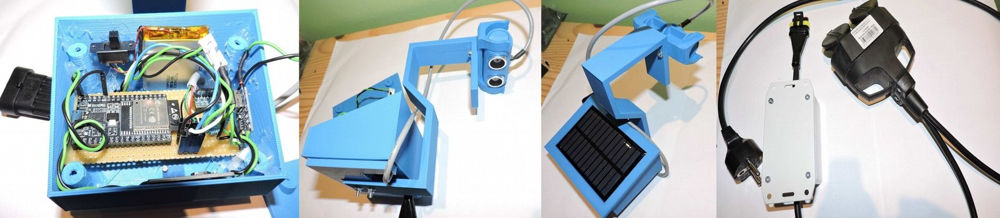
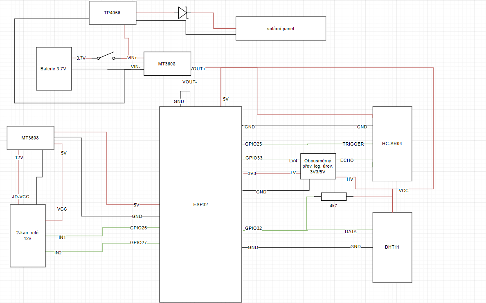
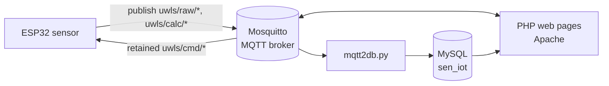
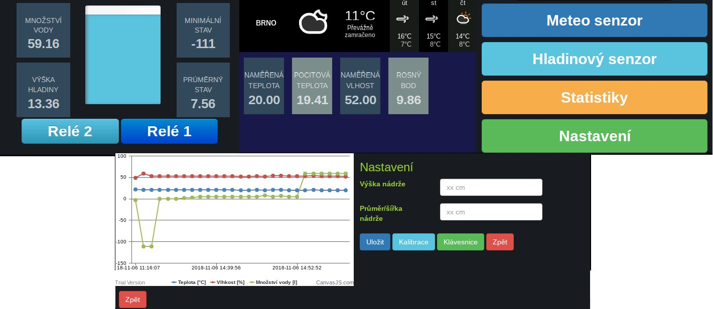

# Water Level Sensor

**SEN course project** · Brno University of Technology, Faculty of Information Technology · 2018/2019
**Author:** Pavel Koupý

> English adaptation of the original Czech project documentation ([`dokumentace.pdf`](dokumentace.pdf)) and Raspberry Pi install notes ([`instalace_rpi.txt`](instalace_rpi.txt)). The text is translated and lightly condensed. Details missing from the PDF were filled in from the source code.

<p align="center">
  <br>
  <em>Figure 1: The finished hardware. From left: the open sensor housing with the ESP32 and Li-Po battery, the housing with the ultrasonic sensor mount, the top cover with the solar panel, and the 230 V switching module with its Superseal connector and socket.</em>
</p>

## Overview

The goal was to build a sensor that measures the water level in a tank using an **ESP32** and an **ultrasonic distance sensor**. The sensor sends its measurements to a server (an **MQTT broker**), where they can be read and stored. In the code the device is called **UWLS** (ultrasonic water level sensor).

On top of the assignment, the sensor can also:

- measure air temperature and humidity,
- switch two 230 V AC devices,
- recharge its battery from a solar panel,
- be configured for the size of the tank.

## Contents

1. [Hardware](#1-hardware)
   - [1.1 Parts list](#11-parts-list)
   - [1.2 Wiring](#12-wiring)
2. [Software](#2-software)
   - [2.1 ESP32 firmware](#21-esp32-firmware)
   - [2.2 Server](#22-server)
   - [2.3 Visualization](#23-visualization)
   - [2.4 Calibration](#24-calibration)
3. [Raspberry Pi setup](#3-raspberry-pi-setup)
4. [Conclusion](#4-conclusion)
5. [Repository layout](#repository-layout)
6. [References](#references)

---

## 1. Hardware

Several components had to be connected. Distance is measured with a simple ultrasonic ping. A temperature and humidity sensor was added for wider use. A separate module that switches two 230 V AC devices can also be plugged in, through a waterproof connector. It could drive, for example, an irrigation pump or a valve that refills the tank.

A real deployment would need some degree of waterproofing. This is demonstrated by the **Superseal** waterproof connector used for the switching module, and by the housing design:

- The top cover with the solar panel overhangs the body and is slightly sloped, so water doesn't run inside.
- All cables leave through the bottom, sealed with rubber grommets and hot glue.
- The ultrasonic sensor can at most handle splashing water. In its current state it isn't ready for outdoor use.

All housing parts are 3D-printed in **PLA** at **0.35 mm** layer height, without supports (models in [`model_tisk/`](model_tisk)). The switching module uses a generic off-the-shelf prototyping enclosure.

### 1.1 Parts list

| Unit | Components |
|---|---|
| **Sensor** | ESP WROOM32 · HC-SR04 ultrasonic sensor · DHT11 temperature/humidity sensor · bidirectional 3.3 V / 5 V logic-level shifter · TP4056 charger · MT3608 step-up converter · 6 V 0.6 W solar panel · 3.7 V 900 mAh Li-Po battery · ZY6.8 Zener diode · 4.7 kΩ resistor |
| **Server** | Raspberry Pi · 3.2" TFT touch display |
| **230 V switching module** | 2-channel 12 V relay module · MT3608 step-up converter · waterproof two-pin socket |

### 1.2 Wiring

<p align="center">
  <br>
  <em>Figure 2: Wiring diagram. Czech labels: "solární panel" = solar panel, "Baterie 3.7V" = 3.7 V battery, "Obousměrný převod. log. úrov. 3V3/5V" = bidirectional 3.3 V/5 V logic-level shifter, "2-kan. relé 12V" = 2-channel 12 V relay.</em>
</p>

ESP32 pin assignment (from [`senzor.ino`](src/senzor/senzor.ino)):

| GPIO | Connected to |
|---|---|
| 25 | HC-SR04 Trigger |
| 33 | HC-SR04 Echo (through the level shifter) |
| 32 | DHT11 data (4.7 kΩ pull-up) |
| 26 | Relay IN1, also the buzzer/LED used for calibration (Superseal pin 4) |
| 27 | Relay IN2 (Superseal pin 3) |

The Superseal connector to the switching module carries: pin 1 GND, pin 2 5 V, pin 3 GPIO27, pin 4 GPIO26. The module's own MT3608 boosts the 5 V to 12 V for the relays.

## 2. Software

The software has three parts: the sensor firmware, the server setup, and visualization and further processing of the data.


<p align="center"><em>Figure 3: Data flow (all server parts run on the Raspberry Pi)</em></p>

### 2.1 ESP32 firmware

The sensor is programmed in the **Arduino IDE** with the **ESP32-Arduino** core ([`senzor.ino`](src/senzor/senzor.ino)). The whole design aims to save as much energy as possible: after finishing its tasks, the ESP32 enters **deep sleep**. Data is sent over **MQTT** using the [PubSubClient](https://github.com/knolleary/pubsubclient) library.

On each wake-up the sensor:

1. connects to Wi-Fi and the MQTT broker and subscribes to the command topics,
2. reads temperature and humidity from the DHT11. The **DHTesp** library also computes the **heat index** (feels-like temperature) and **dew point**. These derived values aren't exact, because the formula uses a fixed barometric pressure and the sensor has no pressure sensor,
3. measures the distance to the water surface (`duration × 0.034 / 2`, in cm),
4. computes the water volume and fill level from the calibrated tank size (see [Calibration](#24-calibration)),
5. publishes everything as retained messages,
6. handles incoming commands for about 10 s (200 × 50 ms), then goes back to sleep.

The sleep period is **60 s**. If any measured or computed value is invalid, the sensor publishes `UWLS ERROR` to `uwls/debug` and sleeps for **300 s** instead.

Because the sensor sleeps most of the time, commands for it are sent as **retained** messages, so it picks them up when it wakes.

| Topic | Direction | Content |
|---|---|---|
| `uwls/raw/temp` | sensor → | temperature [°C] |
| `uwls/raw/humid` | sensor → | relative humidity [%] |
| `uwls/raw/dist` | sensor → | distance from sensor to water surface [cm] |
| `uwls/calc/heatIndex` | sensor → | heat index [°C] |
| `uwls/calc/dewPoint` | sensor → | dew point [°C] |
| `uwls/calc/volume` | sensor → | water volume [l] |
| `uwls/calc/tankLevel` | sensor → | fill level [%] |
| `uwls/debug` | sensor → | status/debug messages |
| `uwls/cmd/relay1`, `uwls/cmd/relay2` | → sensor | `1` = relay on, otherwise off |
| `uwls/cmd/width`, `uwls/cmd/height` | → sensor | `1` followed by the tank diameter / height, saved to flash |
| `uwls/cmd/calibration` | → sensor | `1` = start calibration |

Volume is computed for a cylindrical tank: *V* = π · *d*² / 4 · (*h*<sub>tank</sub> − *distance*), converted from cm³ to litres.

### 2.2 Server

The server is a Raspberry Pi running **Raspbian**, with the **Mosquitto** MQTT broker and an **Apache** web server with **PHP** and a **MySQL** database. None of these come with the base system, so they have to be installed and partly configured. See [Raspberry Pi setup](#3-raspberry-pi-setup).

An important piece is copying data from the MQTT topics into the MySQL database, so statistics and further calculations are possible. This is done by a Python script, [`mqtt2db.py`](src/mqtt2db/mqtt2db.py), using the [Eclipse Paho](https://www.eclipse.org/paho/clients/python/docs/) client. It runs at system startup ([`crontab.txt`](src/mqtt2db/crontab.txt), an `@reboot` cron entry), listens on the sensor's `uwls/raw/*` and `uwls/calc/*` topics in an endless loop and inserts every message into the database. The first part of the topic is looked up by name in the `sensor` table, so that table needs a row named `uwls`.

### 2.3 Visualization

The data is shown through Apache and PHP, using [Mosquitto-PHP](https://github.com/mgdm/Mosquitto-PHP) as the MQTT client and the MySQL database for stored data. There are several demo pages ([`src/web/`](src/web)) sized for the Pi's small touch display. The styling is basic and only meant as a demo. To speed things up, free [Bootstrap snippets](https://bootsnipp.com) were used with small changes.

| Page | Content |
|---|---|
| [`index.php`](src/web/index.php) | Menu: weather sensor, level sensor, statistics, settings |
| [`sensor_dht11.php`](src/web/sensor_dht11.php) | Temperature, heat index, humidity and dew point, plus a weather-forecast widget |
| [`sensor_uwls.php`](src/web/sensor_uwls.php) | Water volume, measured distance, fill-level bar, minimum and average volume from the database, and buttons to toggle the two relays |
| [`stats.php`](src/web/stats.php) | Chart of temperature, humidity and water volume over time (CanvasJS) |
| [`setting.php`](src/web/setting.php) | Enter tank height and diameter, start calibration, open the on-screen keyboard |

<p align="center">
  <br>
  <em>Figure 4: Web interface. Top: level sensor page ("Množství vody" = water volume, "Výška hladiny" = level/distance, "Minimální/Průměrný stav" = minimum/average, "Relé" = relay), weather sensor page ("Naměřená teplota" = measured temperature, "Pocitová teplota" = feels-like temperature, "Naměřená vlhkost" = measured humidity, "Rosný bod" = dew point) and the main menu. Bottom: statistics and settings ("Výška nádrže" = tank height, "Průměr/šířka nádrže" = tank diameter/width, "Uložit" = save, "Kalibrace" = calibrate, "Klávesnice" = keyboard, "Zpět" = back).</em>
</p>

### 2.4 Calibration

Calibration is started from the settings page. Its steps are signalled by an LED or a piezo buzzer connected to the Superseal connector between pin 4 (data) and ground on pin 1.

1. When the sensor wakes and finds a calibration request, the buzzer **beeps twice**.
2. The user has **10 seconds** to point the sensor across the tank to measure its **diameter**.
3. The end of that measurement is signalled by **one long beep**.
4. The user has another **10 seconds** to put the sensor back in its normal position, to measure the **height of the empty tank**.
5. The end of calibration is signalled by **two beeps**.

The measured values are written to **flash** (SPIFFS files `/calibration_width.txt` and `/calibration_height.txt`). They're read on every wake-up and used to compute the volume and fill level. The same values can also be entered by hand on the settings page.

> **Note (from the code):** pin 4 of the connector is GPIO26, which also drives relay 1, so the calibration signal goes to the relay input when the switching module is plugged in.

## 3. Raspberry Pi setup

Translated from [`instalace_rpi.txt`](instalace_rpi.txt). Commands are as in the original notes, with passwords replaced by placeholders.

### Mosquitto MQTT broker

```bash
wget http://repo.mosquitto.org/debian/mosquitto-repo.gpg.key
sudo apt-key add mosquitto-repo.gpg.key

cd /etc/apt/sources.list.d/
sudo wget http://repo.mosquitto.org/debian/mosquitto-stretch.list
sudo apt-get update
sudo apt-get install mosquitto mosquitto-clients mosquitto-dev
```

Set a password:

```bash
sudo service mosquitto stop

sudo mosquitto_passwd -c /etc/mosqruitto/passwd

# run again
sudo mosquitto -c /etc/mosquitto/passwd
```

> The notes contain a typo (`/etc/mosqruitto/` should be `/etc/mosquitto/`). Also, `mosquitto -c` expects a configuration file. Normally you'd point `password_file` in `/etc/mosquitto/mosquitto.conf` at the password file and restart the service.

### Environment

```bash
sudo apt-get install chromium-browser
sudo apt-get install apache2
sudo apt-get install php libapache2-mod-php
```

### PHP Mosquitto client (web)

```bash
sudo apt-get install php-pear
sudo apt-get install php-dev
sudo apt-get install libmosquitto-dev
sudo pecl install Mosquitto-alpha

cd /etc/php/7.0/mods-available
sudo nano mosquitto.ini
#   - add "extension=mosquitto.so"

sudo phpenmod mosquitto
sudo service apache2 restart
```

### Python Paho client (`mqtt2db` script)

This section is empty in the original notes. The script imports `paho.mqtt.client` and `mysql.connector`, so it needs the `paho-mqtt` and `mysql-connector-python` packages. Copy it to `/home/pi/mqtt2db.py` and add the line from [`crontab.txt`](src/mqtt2db/crontab.txt) with `crontab -e`.

### Database

```bash
sudo apt install mysql-server php-mysql
```

```sql
DROP USER 'root'@'localhost';
CREATE USER 'root'@'localhost' IDENTIFIED BY '<password>';
GRANT ALL PRIVILEGES ON *.* TO 'root'@'localhost'

create database sen_iot;
create table sen_iot.sensor(
   id INT NOT NULL AUTO_INCREMENT,
   name VARCHAR(100) NOT NULL,
   type INT NOT NULL,
   refresh_rate INT NOT NULL,
   place VARCHAR(100),
   PRIMARY KEY ( id )
);

create table sen_iot.data(
    id INT NOT NULL AUTO_INCREMENT,
    sensor_id INT NOT NULL,
    quantity_type VARCHAR(40) NOT NULL,
    quantity VARCHAR(40) NOT NULL,
    value INT NOT NULL,
    time DATETIME DEFAULT CURRENT_TIMESTAMP,
    PRIMARY KEY ( id ),
    FOREIGN KEY (sensor_id) REFERENCES sensor(id)
);
```

`mqtt2db.py` splits each topic (e.g. `uwls/raw/temp`) into the sensor name (`uwls` → `sensor_id`), `quantity_type` (`raw`/`calc`) and `quantity` (`temp`).

### Configuration

Wi-Fi, MQTT and database credentials are hard-coded. Set them in [`senzor.ino`](src/senzor/senzor.ino) (`WIFI_*`, `MQTT_*`; `MQTT_SERVER` must be the Pi's IP address, not `localhost`), [`mqtt2db.py`](src/mqtt2db/mqtt2db.py) and the PHP pages in [`src/web/`](src/web).

## 4. Conclusion

The sensor was successfully built and works. The housing and some other parts need more testing. The assignment was met, though some parts are only demonstrations.

Possible improvements:

- **Dynamic Wi-Fi configuration**, e.g. over Bluetooth from an Android device. Apps for this kind of setup already exist.
- The **ultrasonic sensor** needs a few more design iterations before it's usable outdoors. It could be replaced with the waterproof **JSN-SR04T**, but that one only measures from about 20 cm.
- In a real deployment, an existing open **IoT framework**, which already includes management and visualization tools, would probably work better.

## Repository layout

```
SEN/
├── dokumentace.pdf            # original documentation (Czech)
├── instalace_rpi.txt          # Raspberry Pi install notes (Czech)
├── docs/images/               # figures used in this README
├── model_tisk/                # 3D-printable parts (STL)
│   ├── 3Dmodel.zip            # archive with a subset of the STL files
│   ├── pouzdro_telo.stl       # housing body
│   ├── pouzdro_vrch.stl       # housing top cover (solar panel)
│   ├── uchyt_*.stl            # mount parts
│   ├── ukotveni_spodek.stl    # anchoring base
│   ├── ult_drzak.stl          # ultrasonic sensor holder
│   └── ult_sensor_*.STL, ult_telo_*.STL  # ultrasonic sensor enclosure parts
└── src/
    ├── senzor/
    │   └── senzor.ino         # ESP32 firmware (measurement, MQTT, deep sleep, calibration)
    ├── mqtt2db/
    │   ├── mqtt2db.py         # MQTT → MySQL bridge
    │   └── crontab.txt        # @reboot entry that starts the bridge
    └── web/                   # PHP demo pages for the Pi's touch display
        ├── index.php          # menu
        ├── sensor_dht11.php   # temperature/humidity page
        ├── sensor_uwls.php    # water level page + relay control
        ├── stats.php          # history chart
        ├── setting.php        # tank size and calibration
        ├── style.css
        └── jquery.js
```

Key files: [`senzor.ino`](src/senzor/senzor.ino), [`mqtt2db.py`](src/mqtt2db/mqtt2db.py), [`sensor_uwls.php`](src/web/sensor_uwls.php), [`setting.php`](src/web/setting.php).

## References

1. Espressif. *ESP32 Datasheet.* <https://www.espressif.com/sites/default/files/documentation/esp32_datasheet_en.pdf>
2. HiveMQ. *MQTT Essentials Part 4: MQTT Publish, Subscribe & Unsubscribe.* <https://www.hivemq.com/blog/mqtt-essentials-part-4-mqtt-publish-subscribe-unsubscribe>
3. Eclipse Paho. *Python Client documentation.* <https://www.eclipse.org/paho/clients/python/docs/>
