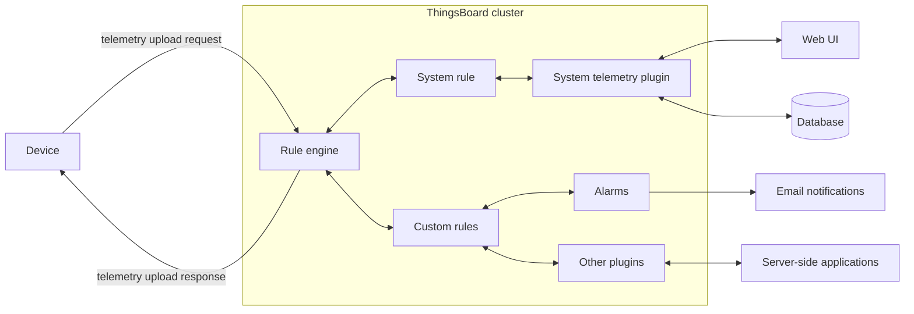
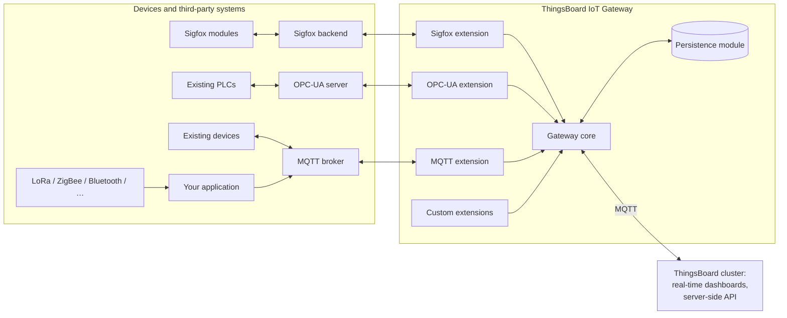

# IoT – Survey and Demonstration of Open-Source Tools

**Course project (SIN)** · Brno University of Technology, Faculty of Information Technology · 2018/2019
**Author:** Bc. Pavel Koupý

> English adaptation of the original Czech documentation ([`dokumentace.pdf`](dokumentace.pdf)). The text is translated and lightly condensed. Diagrams copied from third-party framework documentation are not reproduced; links to the original sources are given instead.

<p align="center">
  
</p>

## Abstract

This project surveys available open-source tools and frameworks for monitoring and controlling IoT systems, and demonstrates one of them. The demo includes a dashboard for visualization, a database and simple control of devices built on the **ESP32** and **ESP8266** microcontrollers. The devices communicate over **MQTT**. The demo consists of simple sensors (temperature and humidity) and relay modules as actuators.

**Keywords:** IoT, ThingsBoard, DeviceHive, Freedomotic, MQTT, ESP32, ESP8266, home automation

## Contents

1. [Technology survey](#1-technology-survey)
2. [Frameworks and middleware](#2-frameworks-and-middleware)
   - [2.1 ThingsBoard](#21-thingsboard)
   - [2.2 DeviceHive](#22-devicehive)
   - [2.3 Freedomotic](#23-freedomotic)
3. [Demonstration – ThingsBoard](#3-demonstration--thingsboard)
   - [3.1 Temperature/humidity sensor](#31-temperaturehumidity-sensor)
   - [3.2 Air-conditioning unit](#32-air-conditioning-unit)
   - [3.3 LED light/matrix](#33-led-lightmatrix)
   - [3.4 Control panel](#34-control-panel)
4. [Conclusion](#4-conclusion)
5. [Repository layout](#repository-layout)
6. [References](#references)

---

## 1. Technology survey

The survey started from comparisons on web portals that pointed to software popular in the open-source IoT community. A second starting point, and really the motivation, was experience with a bare-metal solution [[1]](#references) built without any tools for managing and monitoring IoT devices. From that point of view it always seems better to start from one of the freely available solutions, as these technologies are the current trend.

For the final design of any IoT device, the important factors are:

- the available **communication protocols**,
- the range of supported **third-party technologies**, both hardware and software,
- how quickly things can be **integrated and put into operation**.

From the user's point of view, an important feature is how the system models **hierarchical relationships** that reflect real-world use: how individual devices relate to individual users and roles in the information system or IoT middleware.

## 2. Frameworks and middleware

IoT tools are usually built as a **monolithic system** that contains everything needed for data extraction, analysis, control and possibly visualization. A newer approach is a **microservice architecture**, where the parts of the IoT framework or middleware are split into separate, loosely cooperating processes. This lets the application be built and extended step by step without touching the whole thing. Development scales better, and integrating a new component doesn't require changes to a monolithic system.

### 2.1 ThingsBoard

[ThingsBoard](https://thingsboard.io) [[3]](#references) provides both an information system for management and control and a framework in the form of a **gateway** application. The gateway mainly collects data from third-party technologies and passes it on to the information system for processing.

ThingsBoard was chosen for the demonstration, so it is described in more detail here. The principles described also apply to the other tools. It can be installed manually or with [Docker](https://www.docker.com/).

#### Data collection

At the application layer, devices can use **MQTT**, [CoAP](http://coap.technology/) or **HTTP**. MQTT, which the demo uses, sends messages as **JSON**, in one of two ways:

**a) Telemetry sent directly to the ThingsBoard instance**


<p align="center"><em>Figure 1: Telemetry sent directly to the instance (redrawn after the ThingsBoard documentation)</em></p>

The device firmware needs an MQTT client and callback functions for telemetry requests, which are also JSON. Incoming data enters the **Rule Engine**, the flow-control logic for incoming data. Based on its analysis, it produces responses such as requests, e-mails or alarms. Telemetry is stored in the database and can be visualized with ready-made widgets: gauges, switches, charts and so on.

**b) Data sent through the gateway**

The second way is meant for integrating third-party technologies, for example an external MQTT broker. The **ThingsBoard IoT Gateway** is shipped as an installation package for Linux, Windows and Raspberry Pi. It forwards the data to the information system over MQTT, and it can integrate other protocols such as ZigBee or LoRaWAN.


<p align="center"><em>Figure 2: Data sent through the gateway (redrawn after the ThingsBoard documentation)</em></p>

#### User interface

The information system lets you group devices into larger units (buildings), and assign those units to locations and to individual customers. This hierarchy is pleasant to work with and close to reality.

Control logic is configured with **Rule Chains** in a graphical editor; they decide what happens when a message arrives. The default setup contains a switch for four kinds of messages, in particular telemetry and remote procedure calls ([RPC](https://thingsboard.io/docs/user-guide/rpc/)).

<p align="center">
  <br>
  <em>Figure 3: Rule Chains</em>
</p>

The system supports [multitenancy](https://en.wikipedia.org/wiki/Multitenancy): one instance is shared by several separate business units, companies or institutions, so these groups and their administrators must be kept apart. The **system administrator** has the highest rights and creates **tenant administrators**. They can add and group devices and customers, create dashboards and so on. **Customers** only have a role that lets them read their own dashboards and devices.

Devices are identified by an **access token** or an **X.509 certificate**. For each device you can set alarms (reactions to events) and view the latest telemetry and the device attributes.

<p align="center">
  <br>
  <em>Figure 4: Device – access token (token redacted)</em>
</p>

#### Visualization

Device telemetry and attributes are visualized with predefined **widgets**. Data are mapped onto them to monitor or control the device.

<p align="center">
  <br>
  <em>Figure 5: Widgets available for visualization</em>
</p>

Out of the box there are various gauges, control elements, GPIO controls, charts and maps. These can be combined into **dashboards**. You can also create your own widgets, and everything can be customized down to the JavaScript level, which is a big plus.

For the demo, ThingsBoard was installed with the installer, which requires a database server as a prerequisite, here **PostgreSQL**.

### 2.2 DeviceHive

[DeviceHive](https://docs.devicehive.com/) [[4]](#references) is built on a **microservice architecture** with plugin support (see the [architecture diagram](https://docs.devicehive.com/) in its documentation). Plugins are managed with [Swagger](https://swagger.io). Communication uses JSON messages, with authentication by [JSON Web Tokens](https://jwt.io/). Unlike ThingsBoard, it doesn't provide middleware with a full information system. It also uses a PostgreSQL database.

Relevant to this project, the developers provide [firmware](https://github.com/devicehive/esp8266-firmware) for collecting data and connecting an ESP8266 to the DeviceHive cloud. Messages are carried by the **WebSocket Kafka Proxy** microservice.

**Visualization** is done with the **Grafana** plugin.

### 2.3 Freedomotic

[Freedomotic](https://freedomotic-user-manual.readthedocs.io) [[2]](#references) is an interesting IoT framework focused on **high-level commands in natural language**. It works with a map of the environment, the objects in it and the people in it. Messages look like "turn on the light in the kitchen" and are handled by a natural-language processor. At the time of writing the system was in an advanced beta.

Behaviour rules together with the language processor let you build automations from natural-language sentences, e.g. "If it is dark outside, turn on the light in the room". The documentation describes how events, plugins, triggers and other components interact. **Device plugins** add support for new technologies such as ThingSpeak, an MQTT broker/client or a mail agent. As with DeviceHive, the graphical front end has to come from a third party.

## 3. Demonstration – ThingsBoard

To demonstrate one of the frameworks, several circuits were built that act as sensors and actuators, based on the **ESP32** and **ESP8266** SoCs. All of them talk to a ThingsBoard server on the local network over MQTT (port 1883), each with its own access token.

<p align="center">
  <br>
  <em>Figure 10: Devices in the web UI</em>
</p>

| Device (in ThingsBoard) | Board | Role | Firmware | Communication |
|---|---|---|---|---|
| `th_sensor` | ESP8266 | Temperature/humidity sensor (DHT11) | [`sin_02.ino`](src/sin_esp8266_dht11/sin_02.ino) | PubSubClient, publishes telemetry |
| `ac_unit` | ESP32 | Simulated A/C unit (4-channel relay) | [`sin_01.ino`](src/sin_eps32_acunit/sin_01.ino) | ThingsBoard SDK, RPC `setGpioStatus` |
| `neopixel_matrix` | ESP8266 | LED matrix (25 × WS2811) | [`sin_03.ino`](src/sin_esp8266_ledmatrix/sin_03.ino) | ThingsBoard SDK, RPC `setValue` / `getValue` |

### 3.1 Temperature/humidity sensor

<p align="center">
  <br>
  <em>Figure 11: Wiring and photo of the DHT11 circuit</em>
</p>

The sensor is a **DHT11** connected to an ESP8266 (data on pin `D7`, with a 4.7 kΩ pull-up). The firmware initializes the DHT11 and a **PubSubClient** for MQTT. Every **1.5 seconds** it reads temperature and humidity and publishes them to the topic `v1/devices/me/telemetry`. Together with the device's access token this forms a unique identification, so all devices publish to the same topic. The payload also includes the dew point and heat index computed by the `DHTesp` library:

```json
{"temperature": <°C>, "dewpoint": <°C>, "heatindex": <°C>, "humidity": <%>}
```

A **WS2811** LED module on pin `D8` is used only as a sign that the device is connected to Wi-Fi and the MQTT broker (it cycles through FastLED colour palettes while the main loop runs).

### 3.2 Air-conditioning unit

<p align="center">
  <br>
  <em>Figure 12: Wiring and photo of the A/C unit. Labels: <b>Relé 4-kanály</b> = 4-channel relay, <b>Větrák</b> = fan (12 V), <b>LED červená „výhřev“</b> = red LED "heating", <b>LED modrá „chlazení“</b> = blue LED "cooling".</em>
</p>

This demonstrates an actuator using an **ESP32** and a **4-channel relay** module. The firmware consists mainly of a callback for the subscribed MQTT topics: it registers the RPC method `setGpioStatus` with parameters `pin` (0–3) and `enabled`, and switches the corresponding relay output. The demo can't actually cool or heat; that is simulated by red and blue LED lighting of the fan.

| RPC `pin` | ESP32 GPIO (code) | Dashboard label |
|---|---|---|
| 0 | 25 | Cooling |
| 1 | 26 | Unset |
| 2 | 33 | Heating |
| 3 | 32 | Fan |

> **Note:** The schematic wires GPIO 26 → IN1 and GPIO 25 → IN2, with the red "heating" LED on relay 2 and the blue "cooling" LED on relay 3. Following the code (`relay_control[] = {25, 26, 33, 32}`), RPC pin 0 ("Cooling") would therefore switch relay 2, the red LED. Either the schematic or the dashboard labels have heating and cooling swapped. The dashboard's GPIO widget also queries `getGpioStatus`, which the firmware doesn't implement.

### 3.3 LED light/matrix

<p align="center">
  <br>
  <em>Figure 13: Wiring and photo of the LED matrix (<b>pásek-matice</b> = strip/matrix)</em>
</p>

This demonstrates controlling an LED strip of WS2811 modules (the PDF says "WS8211"; the code uses `WS2811`), here arranged as a **5 × 5 matrix** (25 LEDs) on pin `D8`. It uses the simple [ThingsBoard Arduino SDK](https://github.com/thingsboard/ThingsBoard-Arduino-MQTT-SDK) wrapper over PubSubClient. The LEDs are driven by the **FastLED** library.

Turning the knob widget on the dashboard to select a program sends its number (0–3) to the `setValue` RPC callback in the ESP8266 firmware. The firmware stores it in a global variable and uses it as an index into FastLED's built-in colour palettes:

| Program | Palette |
|---|---|
| 0 | `ForestColors_p` |
| 1 | `OceanColors_p` (default) |
| 2 | `LavaColors_p` |
| 3 | `RainbowColors_p` |

A `getValue` RPC returns the current program so the knob shows the right position.

### 3.4 Control panel

<p align="center">
  <br>
  <em>Figure 14: Raspberry Pi with a touchscreen</em>
</p>

A **Raspberry Pi** with a touchscreen is used to control and demonstrate the individual dashboard elements. It also has enough computing power to run the **IoT gateway** for collecting data with third-party technologies and tools, but that part was not implemented. The operating system is a version of **Raspbian Stretch** adapted for the touchscreen. Each dashboard element can be enlarged from the web interface.

<p align="center">
  <br>
  <em>Figure 15: Final dashboard</em>
</p>

The dashboard (exported as [`sin_dashboard.json`](src/sin_dashboard.json)) contains a radial temperature gauge, a humidity bar gauge, a humidity/temperature chart, the "A/C unit control" GPIO switch panel and the "LED matrix program" knob.

## 4. Conclusion

The work didn't deviate much from the abstract. The one change was the host of the ThingsBoard application: it was originally meant to run on the Raspberry Pi, but in the end it runs on a Windows machine.

The demo works. The survey would need a revision, but it covers interesting representatives: a framework with middleware in the form of an information system and graphical programming (ThingsBoard), a pure IoT framework (DeviceHive), and a framework with natural-language processing (Freedomotic).

There is no INSTALL script, because many steps have to be done in the graphical interface and the ESP firmware setup is not fully automated. The [`RUN.bat`](RUN.bat) script starts the ThingsBoard service on Windows. There is no COMPILE script either, since compiling is only needed for the ESP firmware.

### Running the demo

1. Install ThingsBoard (with PostgreSQL) and start it with `RUN.bat` (`net start thingsboard`).
2. Create the three devices in ThingsBoard and import [`src/sin_dashboard.json`](src/sin_dashboard.json).
3. In each sketch, set the Wi-Fi credentials, the ThingsBoard server address and the device's access token:
   ```cpp
   #define WIFI_AP_NAME        "<your-ssid>"
   #define WIFI_PASSWORD       "<your-wifi-password>"
   #define TOKEN               "<device-access-token>"
   #define THINGSBOARD_SERVER  "<thingsboard-host>"
   ```
4. Build and flash the sketches with the Arduino IDE (libraries: `ThingsBoard`, `PubSubClient`, `FastLED`, `DHTesp`, plus ESP32/ESP8266 board support).

## Repository layout

```
SIN/
├── dokumentace.pdf                 # original documentation (Czech)
├── RUN.bat                         # starts the ThingsBoard Windows service
├── docs/images/                    # figures used in this README
└── src/
    ├── sin_dashboard.json          # exported ThingsBoard dashboard
    ├── sin_eps32_acunit/
    │   └── sin_01.ino              # ESP32 A/C unit: 4-channel relay via RPC
    ├── sin_esp8266_dht11/
    │   └── sin_02.ino              # ESP8266 DHT11 sensor: MQTT telemetry
    └── sin_esp8266_ledmatrix/
        └── sin_03.ino              # ESP8266 WS2811 LED matrix: palette via RPC
```

Key files: [`sin_01.ino`](src/sin_eps32_acunit/sin_01.ino), [`sin_02.ino`](src/sin_esp8266_dht11/sin_02.ino), [`sin_03.ino`](src/sin_esp8266_ledmatrix/sin_03.ino), [`sin_dashboard.json`](src/sin_dashboard.json).

## References

1. KOUPÝ, Pavel. *Inteligentní senzory 2018/2019: Senzor pro měření hladiny vody* (Intelligent sensors: water level sensor). See [`../SEN`](../SEN).
2. *Freedomotic user manual.* <https://freedomotic-user-manual.readthedocs.io>
3. *ThingsBoard.* <https://thingsboard.io>
4. *DeviceHive documentation.* <https://docs.devicehive.com/>
