# IoT – Survey and Demonstration of Open-Source Tools

**Course project (SIN)** · Brno University of Technology, Faculty of Information Technology · 2018/2019
**Author:** Pavel Koupý

> English adaptation of the original Czech documentation ([`dokumentace.pdf`](dokumentace.pdf)), translated and condensed. Diagrams taken from third-party framework documentation are not reproduced; links to the original sources are given instead.

<p align="center">
  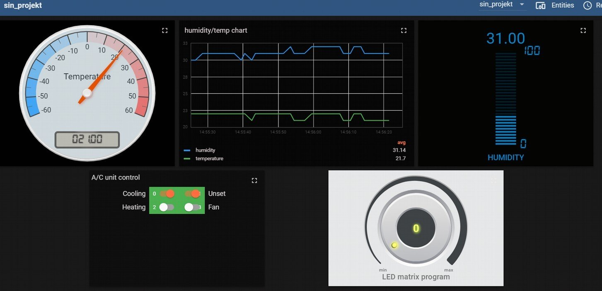
</p>

## Abstract

Survey of open-source frameworks for monitoring and controlling IoT systems (ThingsBoard, DeviceHive, Freedomotic) and a demonstration built on ThingsBoard. The demonstration comprises a dashboard, a database and device control for **ESP32** and **ESP8266** nodes communicating over **MQTT**: a temperature/humidity sensor and relay/LED actuators.

**Keywords:** IoT, ThingsBoard, DeviceHive, Freedomotic, MQTT, ESP32, ESP8266, home automation

## Contents

1. [Technology survey](#1-technology-survey)
2. [Frameworks and middleware](#2-frameworks-and-middleware)
   - [2.1 ThingsBoard](#21-thingsboard)
   - [2.2 DeviceHive](#22-devicehive)
   - [2.3 Freedomotic](#23-freedomotic)
3. [Demonstration – ThingsBoard](#3-demonstration--thingsboard)
   - [3.1 Temperature/humidity sensor](#31-temperaturehumidity-sensor)
   - [3.2 Air-conditioning unit](#32-air-conditioning-unit)
   - [3.3 LED light/matrix](#33-led-lightmatrix)
   - [3.4 Control panel](#34-control-panel)
4. [Conclusion](#4-conclusion)
5. [Repository layout](#repository-layout)
6. [References](#references)

---

## 1. Technology survey

Candidate tools were selected from comparisons on web portals covering software widely used in the open-source IoT community. Reference point: a previous bare-metal implementation [[1]](#references) without any IoT management or monitoring tooling.

Evaluation criteria for an IoT device design:

| Criterion | Description |
|---|---|
| Communication protocols | Application-layer protocols supported for device connectivity |
| Third-party support | Supported external hardware and software technologies |
| Integration effort | Time required to integrate and commission a device |
| Hierarchy modelling | Mapping of devices to users and roles in the information system / middleware |

## 2. Frameworks and middleware

Two architectural patterns are relevant:

- **Monolithic system** – a single application containing data extraction, analysis, control and, optionally, visualization.
- **Microservice architecture** – framework/middleware components run as separate, loosely coupled processes. Components can be added or extended independently, without modifying the whole system.

### 2.1 ThingsBoard

[ThingsBoard](https://thingsboard.io) [[3]](#references) provides an information system for management and control, plus a **gateway** application that collects data from third-party technologies and forwards it to the information system. ThingsBoard is the framework used for the demonstration. Installation: manual installer or [Docker](https://www.docker.com/).

#### Data collection

Supported device protocols (application layer): **MQTT**, [CoAP](http://coap.technology/), **HTTP**. The demonstration uses MQTT with **JSON** payloads. Two data paths exist:

**a) Telemetry sent directly to the ThingsBoard instance**

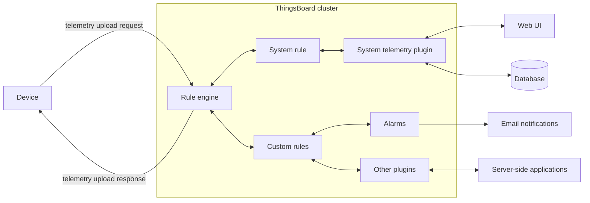
<p align="center"><em>Figure 1: Telemetry sent directly to the instance (redrawn after the ThingsBoard documentation)</em></p>

- Device firmware requires an MQTT client and callback functions for telemetry requests (JSON).
- Incoming messages are processed by the **Rule Engine** (message flow-control logic), which emits requests, e-mails or alarms.
- Telemetry is persisted in the database and rendered by widgets (gauges, switches, charts, etc.).

**b) Data sent through the gateway**

Intended for third-party integration, e.g. an external MQTT broker. The **ThingsBoard IoT Gateway** is distributed as an installation package for Linux, Windows and Raspberry Pi, forwards data to the information system over MQTT, and supports additional protocols (e.g. ZigBee, LoRaWAN).

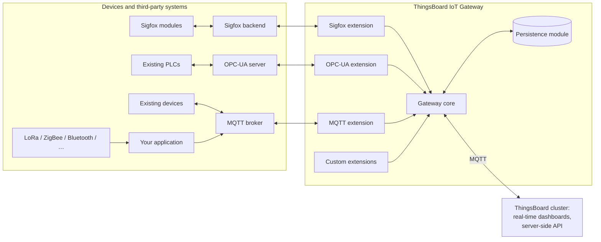
<p align="center"><em>Figure 2: Data sent through the gateway (redrawn after the ThingsBoard documentation)</em></p>

#### User interface

- **Asset hierarchy:** devices are grouped into larger units (buildings), which are assigned to locations and customers.
- **Rule Chains:** control logic defined in a graphical editor; determines message handling. The default root chain contains a switch for four message types, including telemetry and remote procedure calls ([RPC](https://thingsboard.io/docs/user-guide/rpc/)).

<p align="center">
  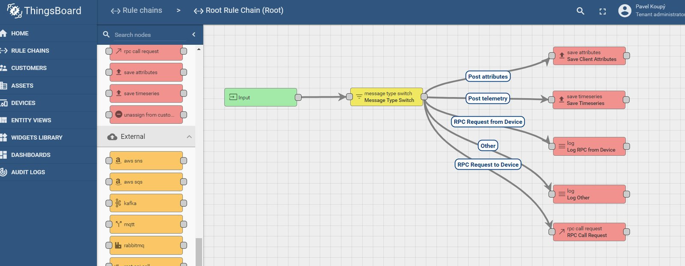<br>
  <em>Figure 3: Rule Chains</em>
</p>

**Multitenancy** ([definition](https://en.wikipedia.org/wiki/Multitenancy)): one instance is shared by isolated business units, companies or institutions. Roles:

| Role | Permissions |
|---|---|
| System administrator | Highest privileges; creates tenant administrators |
| Tenant administrator | Adds and groups devices and customers, creates dashboards |
| Customer | Read-only access to own dashboards and devices |

Device authentication: **access token** or **X.509 certificate**. Per device: alarm configuration (event reactions), latest telemetry, device attributes.

<p align="center">
  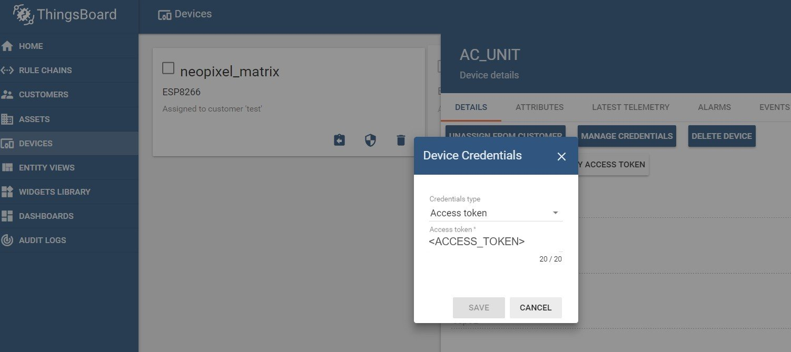<br>
  <em>Figure 4: Device – access token (token redacted)</em>
</p>

#### Visualization

Telemetry and attributes are mapped onto predefined **widgets** for monitoring or control.

<p align="center">
  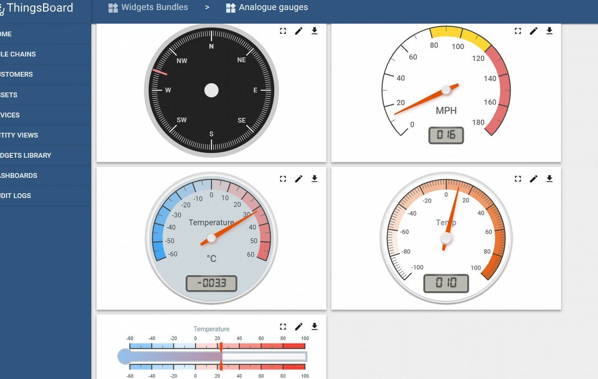<br>
  <em>Figure 5: Widgets available for visualization</em>
</p>

- Built-in widget types: gauges, control elements, GPIO controls, charts, maps.
- Widgets are composed into **dashboards**.
- Custom widgets are supported; all widgets are customizable at the JavaScript level.

Demonstration deployment: ThingsBoard installed via the installer, with **PostgreSQL** as the required database server.

### 2.2 DeviceHive

[DeviceHive](https://docs.devicehive.com/) [[4]](#references):

| Property | Value |
|---|---|
| Architecture | Microservices with plugin support ([architecture diagram](https://docs.devicehive.com/)) |
| Plugin management | [Swagger](https://swagger.io) |
| Message format | JSON |
| Authentication | [JSON Web Tokens](https://jwt.io/) |
| Database | PostgreSQL |
| Message transport | **WebSocket Kafka Proxy** microservice |
| Visualization | **Grafana** plugin |
| ESP8266 support | Official [firmware](https://github.com/devicehive/esp8266-firmware) for data collection and connection to the DeviceHive cloud |

Unlike ThingsBoard, DeviceHive does not include middleware with a full information system.

### 2.3 Freedomotic

[Freedomotic](https://freedomotic-user-manual.readthedocs.io) [[2]](#references) is an IoT framework based on **high-level natural-language commands**. Status at the time of writing: advanced beta.

- **Environment model:** map of the environment, objects and people within it.
- **Commands:** natural-language messages (e.g. "turn on the light in the kitchen") processed by a natural-language processor.
- **Automations:** behaviour rules combined with the language processor, e.g. "If it is dark outside, turn on the light in the room".
- **Components:** events, plugins, triggers; their interaction is specified in the documentation.
- **Device plugins:** add support for technologies such as ThingSpeak, MQTT broker/client, mail agent.
- **GUI:** not included; a third-party front end is required (same as DeviceHive).

## 3. Demonstration – ThingsBoard

Sensor and actuator nodes based on **ESP32** and **ESP8266** SoCs. All nodes connect to a ThingsBoard server on the local network over MQTT (port 1883), each with its own access token.

<p align="center">
  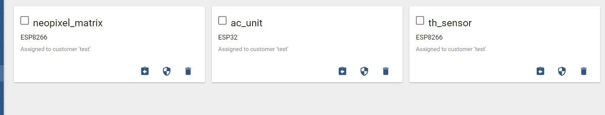<br>
  <em>Figure 10: Devices in the web UI</em>
</p>

| Device (in ThingsBoard) | Board | Role | Firmware | Communication |
|---|---|---|---|---|
| `th_sensor` | ESP8266 | Temperature/humidity sensor (DHT11) | [`sin_02.ino`](src/sin_esp8266_dht11/sin_02.ino) | PubSubClient, publishes telemetry |
| `ac_unit` | ESP32 | Simulated A/C unit (4-channel relay) | [`sin_01.ino`](src/sin_eps32_acunit/sin_01.ino) | ThingsBoard SDK, RPC `setGpioStatus` |
| `neopixel_matrix` | ESP8266 | LED matrix (25 × WS2811) | [`sin_03.ino`](src/sin_esp8266_ledmatrix/sin_03.ino) | ThingsBoard SDK, RPC `setValue` / `getValue` |

### 3.1 Temperature/humidity sensor

<p align="center">
  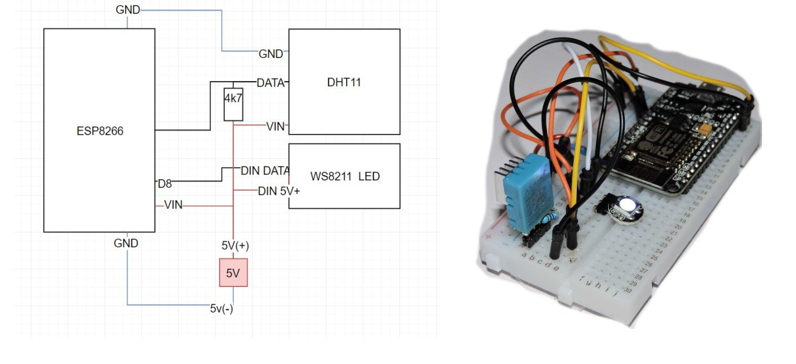<br>
  <em>Figure 11: Wiring and photo of the DHT11 circuit</em>
</p>

| Parameter | Value |
|---|---|
| MCU | ESP8266 |
| Sensor | DHT11, data on `D7`, 4.7 kΩ pull-up |
| MQTT client | PubSubClient |
| Sampling / publish period | 1.5 s |
| Topic | `v1/devices/me/telemetry` |
| Status indicator | WS2811 LED module on `D8` |

- Device identity is given by the access token; all devices publish to the same topic.
- Dew point and heat index are computed by the `DHTesp` library.
- Payload:

```json
{"temperature": <°C>, "dewpoint": <°C>, "heatindex": <°C>, "humidity": <%>}
```

- The WS2811 LED indicates an active Wi-Fi and MQTT broker connection; it cycles through FastLED colour palettes while the main loop runs.

### 3.2 Air-conditioning unit

<p align="center">
  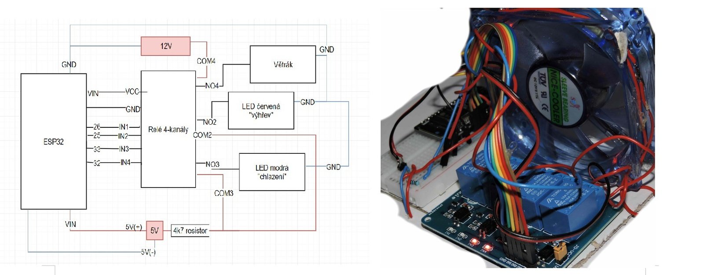<br>
  <em>Figure 12: Wiring and photo of the A/C unit. Labels: <b>Relé 4-kanály</b> = 4-channel relay, <b>Větrák</b> = fan (12 V), <b>LED červená „výhřev“</b> = red LED "heating", <b>LED modrá „chlazení“</b> = blue LED "cooling".</em>
</p>

Actuator node: **ESP32** with a **4-channel relay** module.

- Firmware core: callback for the subscribed MQTT topics, registering RPC method `setGpioStatus` with parameters `pin` (0–3) and `enabled`; switches the corresponding relay output.
- Cooling and heating are simulated by red and blue LED illumination of the fan; no real thermal function.

| RPC `pin` | ESP32 GPIO (code) | Dashboard label |
|---|---|---|
| 0 | 25 | Cooling |
| 1 | 26 | Unset |
| 2 | 33 | Heating |
| 3 | 32 | Fan |

> **Note:** The schematic wires GPIO 26 → IN1 and GPIO 25 → IN2, with the red "heating" LED on relay 2 and the blue "cooling" LED on relay 3. With the code mapping (`relay_control[] = {25, 26, 33, 32}`), RPC pin 0 ("Cooling") switches relay 2, i.e. the red LED. Heating and cooling are therefore swapped either in the schematic or in the dashboard labels. The dashboard GPIO widget also queries `getGpioStatus`, which the firmware does not implement.

### 3.3 LED light/matrix

<p align="center">
  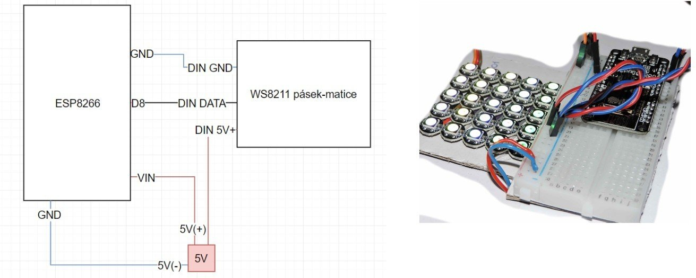<br>
  <em>Figure 13: Wiring and photo of the LED matrix (<b>pásek-matice</b> = strip/matrix)</em>
</p>

| Parameter | Value |
|---|---|
| MCU | ESP8266 |
| LEDs | WS2811 strip, 5 × 5 matrix (25 LEDs) on `D8` (PDF: "WS8211"; code: `WS2811`) |
| MQTT layer | [ThingsBoard Arduino SDK](https://github.com/thingsboard/ThingsBoard-Arduino-MQTT-SDK) (wrapper over PubSubClient) |
| LED driver | FastLED |
| RPC methods | `setValue` (set program), `getValue` (return current program) |

Control flow:

1. The dashboard knob widget sends the selected program number (0–3) via RPC `setValue`.
2. The firmware stores the value in a global variable.
3. The value indexes a built-in FastLED colour palette:

| Program | Palette |
|---|---|
| 0 | `ForestColors_p` |
| 1 | `OceanColors_p` (default) |
| 2 | `LavaColors_p` |
| 3 | `RainbowColors_p` |

4. `getValue` returns the current program so the knob displays the correct position.

### 3.4 Control panel

<p align="center">
  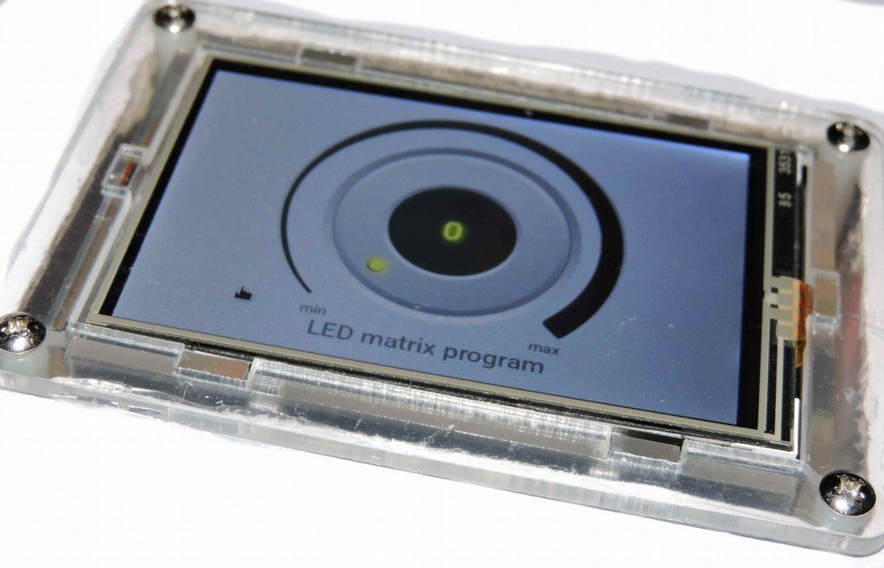<br>
  <em>Figure 14: Raspberry Pi with a touchscreen</em>
</p>

- Hardware: **Raspberry Pi** with touchscreen, used to operate and display dashboard elements; each element can be enlarged from the web interface.
- OS: **Raspbian Stretch**, touchscreen-adapted build.
- The Raspberry Pi has sufficient compute to run the **IoT gateway** for third-party data collection; not implemented.

<p align="center">
  <br>
  <em>Figure 15: Final dashboard</em>
</p>

Dashboard ([`sin_dashboard.json`](src/sin_dashboard.json)) widgets:

- radial temperature gauge,
- humidity bar gauge,
- humidity/temperature chart,
- "A/C unit control" GPIO switch panel,
- "LED matrix program" knob.

## 4. Conclusion

- Demonstration is functional.
- Deviation from the original specification: ThingsBoard runs on a Windows host instead of the Raspberry Pi.
- Survey coverage: one framework with an information-system middleware and graphical programming (ThingsBoard), one pure IoT framework (DeviceHive), one framework with natural-language processing (Freedomotic). The survey requires revision.
- No INSTALL script: several steps require the graphical interface and ESP firmware setup is not fully automated.
- No COMPILE script: compilation applies only to the ESP firmware.
- [`RUN.bat`](RUN.bat) starts the ThingsBoard service on Windows.
- Known issues: heating/cooling mapping inconsistency and missing `getGpioStatus` (see [3.2](#32-air-conditioning-unit)); IoT gateway not implemented.

### Running the demo

1. Install ThingsBoard (with PostgreSQL) and start it with `RUN.bat` (`net start thingsboard`).
2. Create the three devices in ThingsBoard and import [`src/sin_dashboard.json`](src/sin_dashboard.json).
3. In each sketch, set the Wi-Fi credentials, the ThingsBoard server address and the device access token:
   ```cpp
   #define WIFI_AP_NAME        "<your-ssid>"
   #define WIFI_PASSWORD       "<your-wifi-password>"
   #define TOKEN               "<device-access-token>"
   #define THINGSBOARD_SERVER  "<thingsboard-host>"
   ```
4. Build and flash the sketches with the Arduino IDE (libraries: `ThingsBoard`, `PubSubClient`, `FastLED`, `DHTesp`, plus ESP32/ESP8266 board support).

## Repository layout

```
SIN/
├── dokumentace.pdf                 # original documentation (Czech)
├── RUN.bat                         # starts the ThingsBoard Windows service
├── docs/images/                    # figures used in this README
└── src/
    ├── sin_dashboard.json          # exported ThingsBoard dashboard
    ├── sin_eps32_acunit/
    │   └── sin_01.ino              # ESP32 A/C unit: 4-channel relay via RPC
    ├── sin_esp8266_dht11/
    │   └── sin_02.ino              # ESP8266 DHT11 sensor: MQTT telemetry
    └── sin_esp8266_ledmatrix/
        └── sin_03.ino              # ESP8266 WS2811 LED matrix: palette via RPC
```

Key files: [`sin_01.ino`](src/sin_eps32_acunit/sin_01.ino), [`sin_02.ino`](src/sin_esp8266_dht11/sin_02.ino), [`sin_03.ino`](src/sin_esp8266_ledmatrix/sin_03.ino), [`sin_dashboard.json`](src/sin_dashboard.json).

## References

1. KOUPÝ, Pavel. *Inteligentní senzory 2018/2019: Senzor pro měření hladiny vody* (Intelligent sensors: water level sensor). See [`../SEN`](../SEN).
2. *Freedomotic user manual.* <https://freedomotic-user-manual.readthedocs.io>
3. *ThingsBoard.* <https://thingsboard.io>
4. *DeviceHive documentation.* <https://docs.devicehive.com/>
